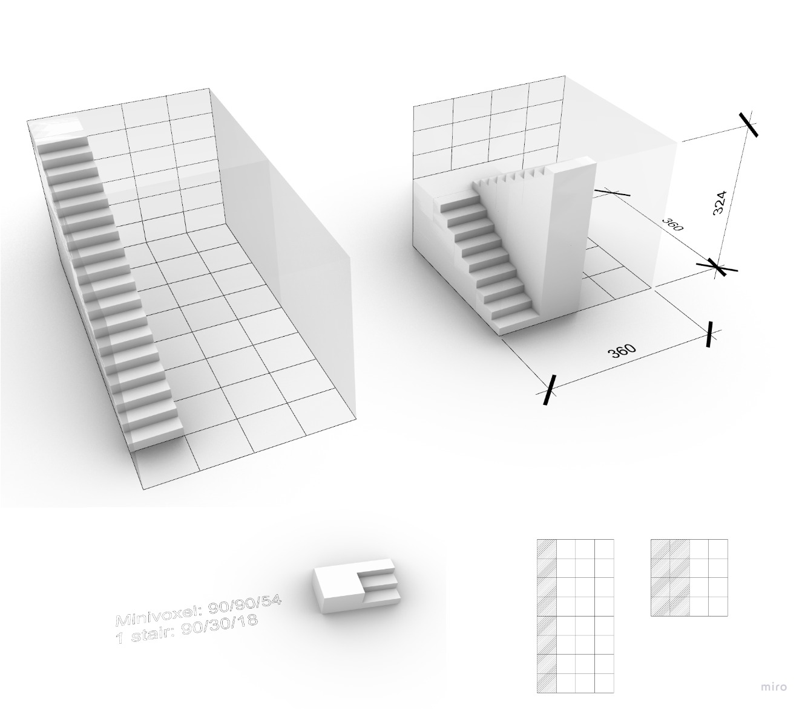
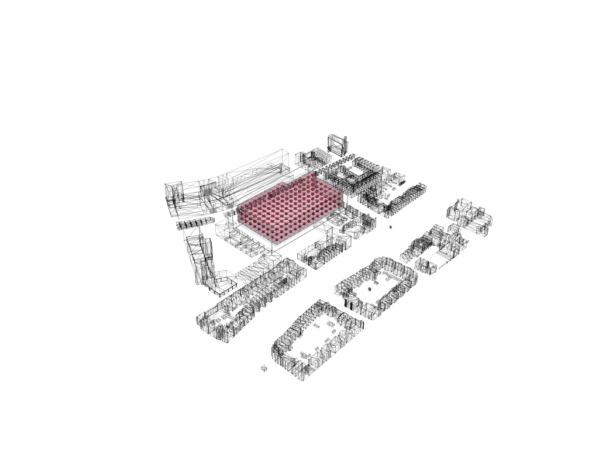
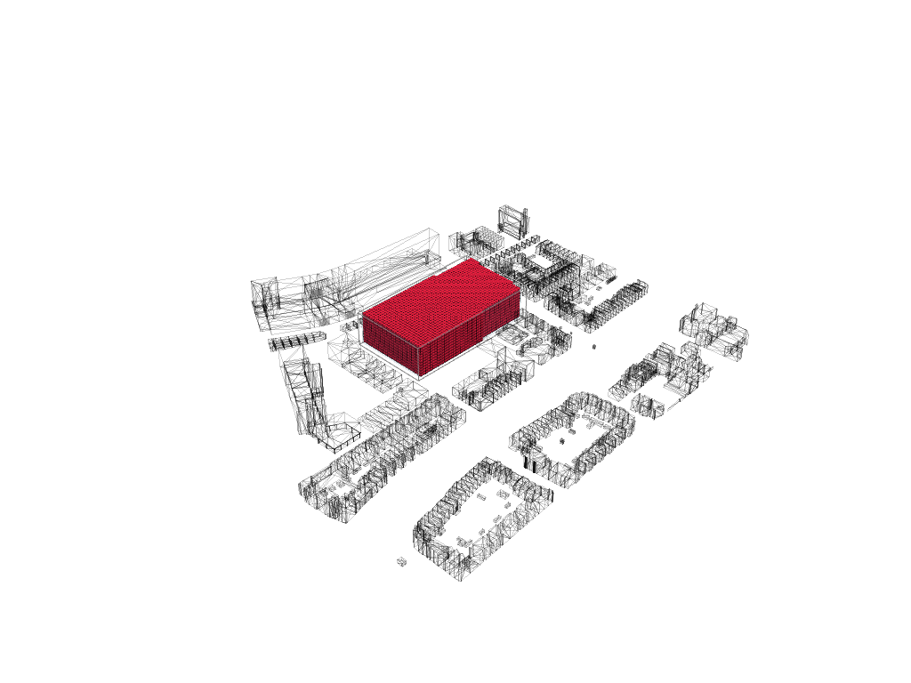
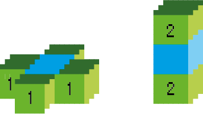
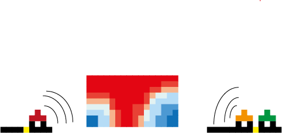
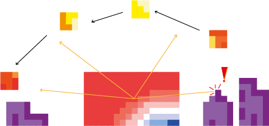
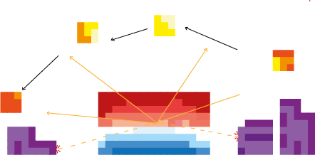
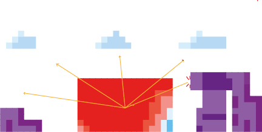
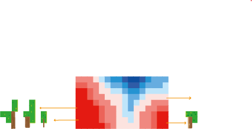

# **Configuring: process**

## Introduction
> In this section all the data which has been made is gathered. The data consists of different fields, in the fields are various perspectives analysed throughout the whole envelope. The choice on the perspectives come from a translation of the design goals and design principles. This data will be used for the next part, massing.

### **Voxel size**
> To define an appropriate voxel size, we used the size of 1 flight of stairs. We defined the size by the use of stairs to create an upward route within the boundaries of a voxel. The dimensions of the stairs size are approximated according to the books ‘’De Menselijke maat’’ (Haak & Leever-Burgh, 1980) and ‘’Het Bouwbesluit’’ (Overveld et al, 2011). These books create a couple requirements the stairs need to fit.

* Requirements: 
    * Angle stairs = 30° – 40°
    *	Rise + Thread + rise =60 – 66 cm
    *	Width 1 person = 90 cm

* Our stairs: 
    * Angle stairs = 32°
    *	Rise + Thread + rise = 66 cm
    *	Width 1 person = 90 cm

The final voxel size chosen according to the flight of stairs is 3.6 x 3.6 x 3.24 (width x depth x height) meters. This voxel size is based on the  measurements of a staircase. The sizes of a mini voxel are 0.9 x 0.9 x 0.54 (width x depth x height) meters to represent a three flight of the stairs. Figure 1 shows the relation between the meso voxel and the mini voxel. The standing platforms between the stairs are 0.90 meters in depth. 

<figure markdown>
  {align=left}
  <figcaption>Fig. 21 Voxel size</figcaption>
</figure>

### **Voxelized envelope low res**
> In figure 2, the low resolution voxelized envelope is shown. The voxel size of this envelope is 10.8 x 10.8 x 9.72 m, 3 times the size of the meso voxel. The lowres envelope will be used to compute the different fields, because the computer cannot handle too many computations. Later in the process the field will be interpolated from the lowres envelope to the highres envelope.  
<figure markdown>
  {align=left}
  <figcaption>Fig. 22 Voxelized envelope lowres</figcaption>
</figure>

### **Voxelized envelope high res**
> Figure 3 shows the high resolution envelope, with a voxel size of 3.6 x 3.6 x 3.24 metres. Eventually we want all the date in the high resolution. Therefore, when the data is computed in the low resolution it is converted into the high resolution. Eventually the agent grow model will also use the high resolution envelope. 
<figure markdown>
  {align=left}
  <figcaption>Fig. 23 Voxelized envelope highres</figcaption>
</figure>

### Main entrance
> In this analysis our objective was to calculate the distance from every voxel to the main entrance. The main entrance was initialized by us prior to the analysis. The main entrance is the voxel with the minimum aggregated distance from the voxel to the main street and public transport stops. For creating a distance field based on walking through the building, we first created two different neighbourhood stencils to work with. The first stencil shows moving horizontally (in x- or y-direction), the value of the neighbours will increment with 1. However, when someone wants to go a level up or down (move vertically), this person needs to take the stairs and this costs more energy than walking on the same level. Therefore, the neighbours in the z-direction will increment with the value of 2. The result is a distance to the main entrance field in which 1 means the closest and 0 the furthest.

<figure markdown>
  
  <figcaption>Fig. 24 Distance to Ground</figcaption>
</figure>
<figure markdown>
  
  <figcaption>Fig. 25 Distance to Ground</figcaption>
</figure>

<iframe src="https://drive.google.com/file/d/1PVmR0BFf2cq39tiwaLSTBNVs9zbdrE2Z/preview" width="900px" height="300px"></iframe>
Fig. 26 Distance to ground flowchart

### Distance to the ground
> This analysis works in a similar way as the distance to the main entrance. This time every voxel calculates the distance between itself and the ground floor. To compute this field only one neighbourhood stencil is needed, because only the vertical movement is incorporated. The distance to the ground field is created to be able to specify how close a certain space wants to be to ground level. The result is a distance to the ground field in which 1 is the closest to ground level and 0 the furthest.
<figure markdown>
  
  <figcaption>Fig. 27 Distance to the Ground</figcaption>
</figure>

<iframe src="https://drive.google.com/file/d/1gn6IroC8c-d6_po1XDo_2UbU96fRxZtC/preview" width="900px" height="300px"></iframe>
Fig. 28 Distance to ground flowchart

### Noise
> Noise is another incorporated perspective, because one of the design principles is to create a good living condition. Reduce noise pollution is one of the aspects of a good living condition. Noise is estimated by looking at the busiest roads surrounding the building site. Noise pollution gets reduced once you get further away from the sound source. So this analysis is calculated by means of the distance between a certain point and a voxel and loudness of each noise source. The result is a noise field in which 1 means the least noise and 0 the most. 

<figure markdown>
  
  <figcaption>Fig. 29 Noise</figcaption>
</figure>

<iframe src="https://drive.google.com/file/d/1NRZ9Z5tXbs4ADDTYxr4RI11CbMjtcA_D/preview" width="900px" height="300px"></iframe>
Fig. 30 Distance to ground flowchart

### Sun access
> Sun access is a perspective which is also related to the design principle of creating a good living condition. Getting enough sun also belongs to a good living condition. For this analysis we had to take the annual path of the sun. From the points of this path the sun shoots rays of light that hit the voxels. The more hits, the higher the sun accessibility. The result is a sun access field in which 1 means the most sun and 0 the least.

<figure markdown>
  
  <figcaption>Fig. 31 Sun accessibility</figcaption>
</figure>

<iframe src="https://drive.google.com/file/d/1e9Nnasi6UWlAjaMEyjvSYO0lpBppy42j/preview" width="900px" height="300px"></iframe>
Fig. 32 Distance to ground flowchart

### Shadow casting
> Calculating the shadows is an addition to the previous analysis. Sun rays are computed in an inverted direction to see where they hit the context. When there is a hit, this means the envelope will cast shadow on the surrounding. The result is a solar envelope in which we the parts which block the most sun are cut away. After the agent growth we can check is the building will not cast too much shadow by comparing the configuration with the solar envelope.

<figure markdown>
  
  <figcaption>Fig. 33 Shadow casting</figcaption>
</figure>

<iframe src="https://drive.google.com/file/d/1WVEsNCrHBYL3iiHQKMFTeT-8O9Aa02hy/preview" width="900px" height="300px"></iframe>
Fig. 34 Distance to ground flowchart

### Sky view factor
> The amount of light which gets into a room has to do with the sun access, but also with the sky view. The more sky is visible, the more light will get into a room. In the sky view analysis we calculated the amount of a sky a voxel can see without being blocked by surrounded structures. The result is a sky view field in which 1 means the biggest sky view fact and 0 the smallest.

<figure markdown>
  
  <figcaption>Fig. 35 Sky view factor</figcaption>
</figure>

<iframe src="https://drive.google.com/file/d/1IY74tjCA-i6ky7r4eXDwXXKygF8T0DDt/preview" width="900px" height="300px"></iframe>
Fig. 36 Distance to ground flowchart

### View on greenery
> The last aspect of a good living condition was a good view on greenery, therefore we created a view on greenery field. This analysis was acquired by looking into the database of tree points made by the city council of Rotterdam (Stadsbeheer Rotterdam, 2016). These points were clustered and they shot rays at the voxels. The more hits, means the higher the value for view on greenery. The result only includes the current greenery in the surrounding, in which 1 means the most view on greenery and 0 the least. However, to improve this analysis in future projects, the greenery, which will eventually be included in the plot, also needs to be taken into account. 

<figure markdown>
  
  <figcaption>Fig. 37 View on greenery</figcaption>
</figure>

<iframe src="https://drive.google.com/file/d/1D3iLna_RNr_O45sSzfyKWXijImskLGda/preview" width="900px" height="300px"></iframe>
Fig. 38 Distance to ground flowchart