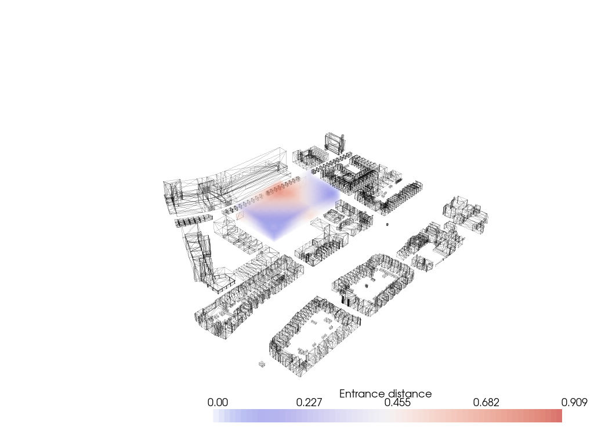
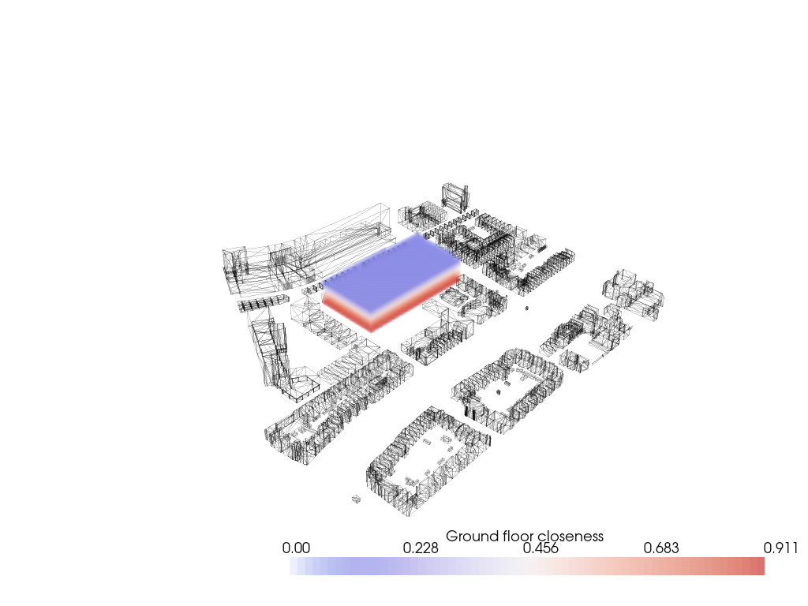
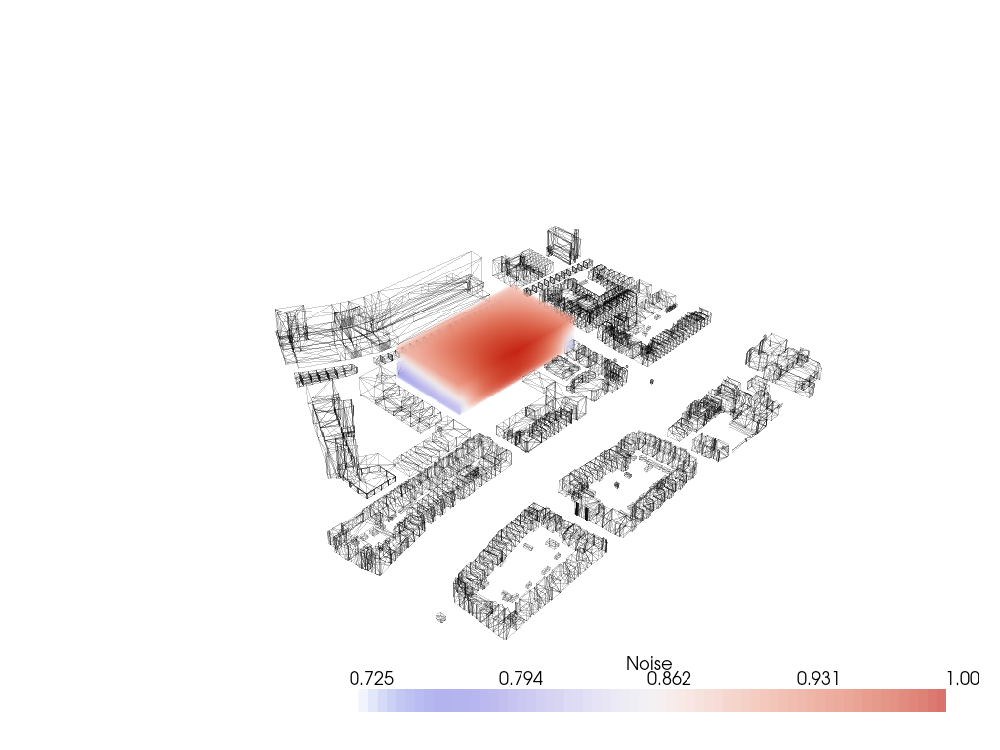
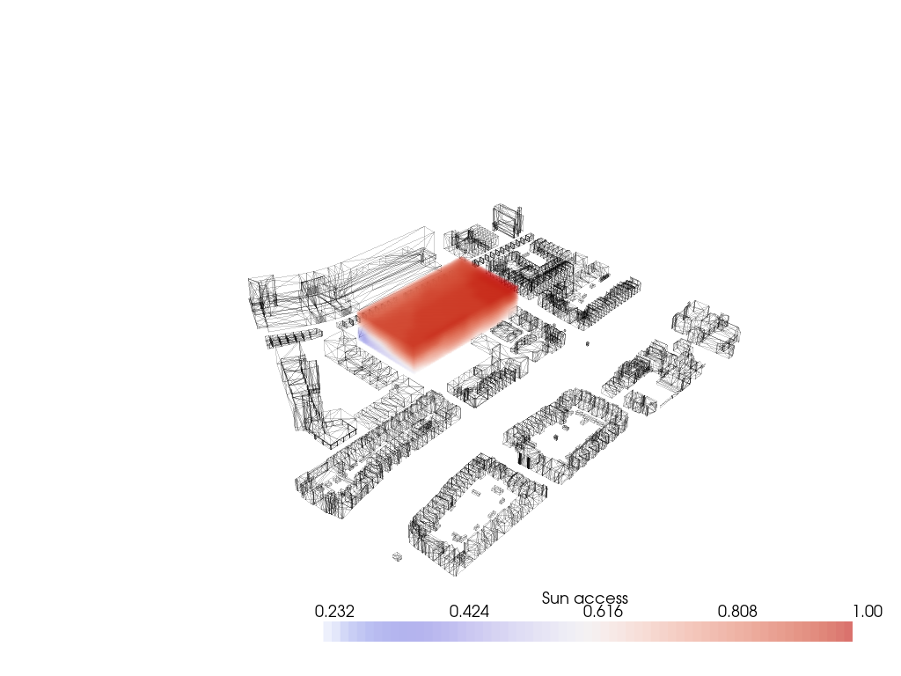
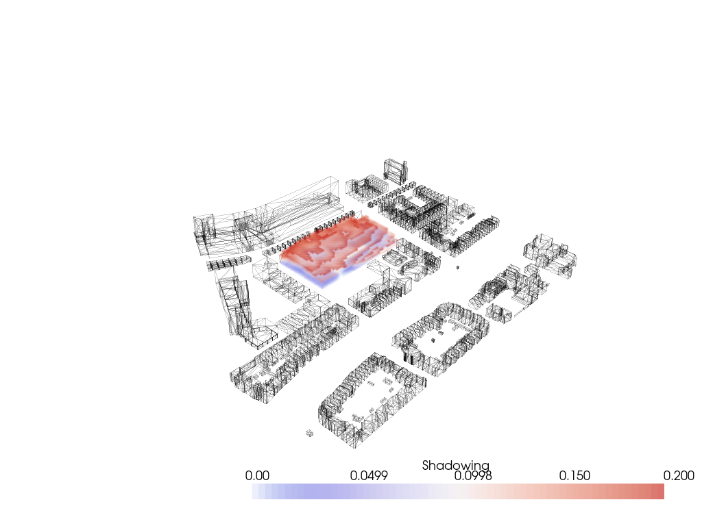
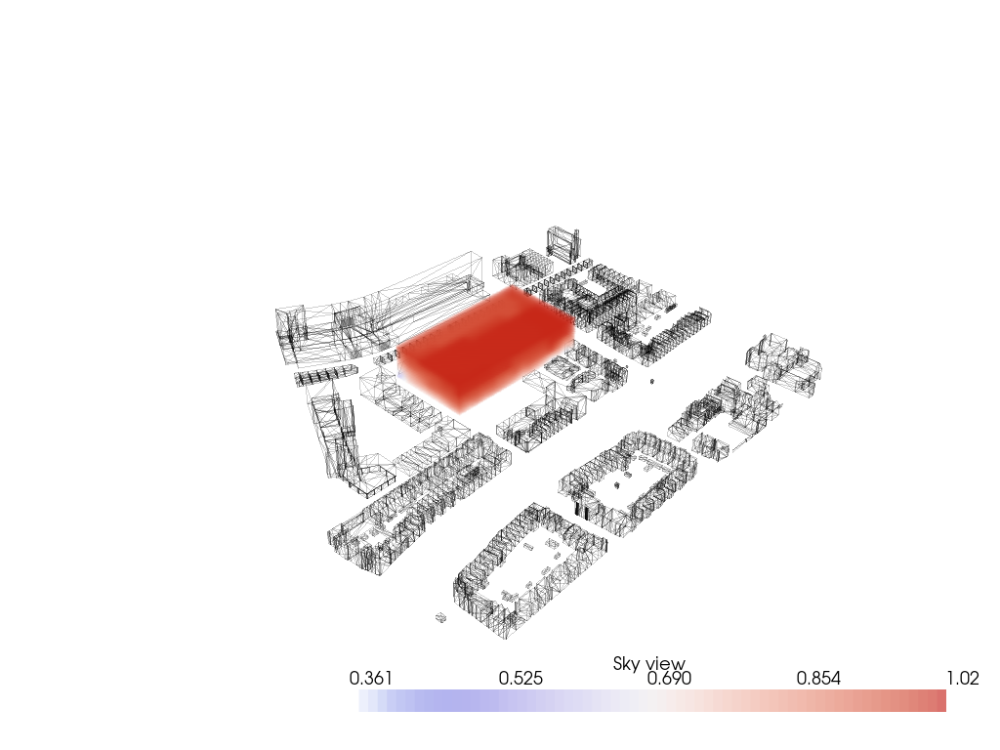
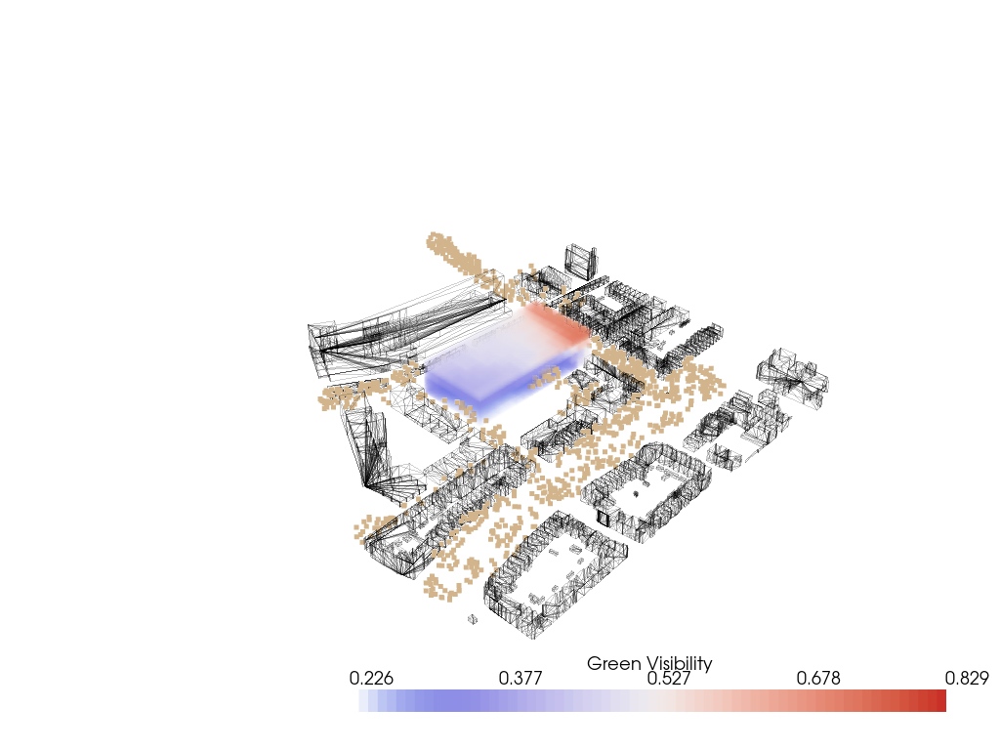

# **Configuring: product**

### **Distance to main entrance **
<figure markdown>
  {align=left}
  <figcaption>Fig. 40 Distance to Main Entrance</figcaption>
</figure>

[**Pseudo code**](https://sarahedelaar.github.io/spatial_computing_project_template/Scripts/distance_entrance/ "View on greenery")
``` python title="Distance_to_main_entrance_field.py" linenums="0"
Input: voxelized_envelope.csv (low and high res), points of main street and public transport

1. Import Meshes
2. Import Lattice and points of main street and public transport
3. Compute from each voxel the average distance to the main street and public transport
4. Choose the voxel with the minimum distance as the main entrance
5. Retrieve the neighbour voxels of the main entrance
6. Set the value of the horizontal neighbours to 1 and the vertical neighbours to 2
7. For each neighbour:
      Find the neighbours and add 1 (horizontal) or 2 (vertical) to its value, when it does not have a value yet
8. Convert the values into values between 0 and 1
9. Construct the field (lowres)
10. Interpolate the lowres field to highres

Output: Distance to main entrance field (low and high res)
```

### **Distance to the ground**
<figure markdown>
  {align=left}
  <figcaption>Fig. 41 Distance to Ground</figcaption>
</figure>

[**Pseudo code**](https://sarahedelaar.github.io/spatial_computing_project_template/Scripts/distance_floor/ "View on greenery")
``` python title="Distance_to_ground_field.ipynb" linenums="0"
Input: voxelized_envelope.csv (low and high res), svf points

1. Import Meshes
2. Import Lattice
3. Initialize vertical adjacency matrix
    Calculate distances to ground floor from every floor
4. Construct the field (lowres)
5. Interpolate the lowres field to highres

Output: Distance to ground field (low and high res)
```

### **Noise**
<figure markdown>
  {align=left}
  <figcaption>Fig. 42 Noise</figcaption>
</figure>

[**Pseudo code**](https://sarahedelaar.github.io/spatial_computing_project_template/Scripts/noise/ "View on greenery")
``` python title="Noise_field.ipynb" linenums="0"
Input: voxelized_envelope.csv (low and high res), noise source points, context mesh

1. Import Meshes
2. Import Lattice and noise source points
3. For each noise source point:
    Assign a value corresponding with the amount of noise from that point
4. For each voxel:
    Compute the distance to the noise source points
5. Multiply the distance by the value of the noise source point
6. Convert the values into values between 0 and 1 (0 = most noise, 1 = no noise)
7. Construct the field (lowres)
8. Interpolate the lowres field to highres

Output: noise field (low and high res)
```

### **Sun Accessibility**
> Sun Accessibility
<figure markdown>
  {align=left}
  <figcaption>Fig. 43 Sun Access</figcaption>
</figure>

[**Pseudo code**](https://sarahedelaar.github.io/spatial_computing_project_template/Scripts/sun_acc/ "View on greenery")
``` python title="Sun_access_field.ipynb" linenums="0"
Input: voxelized_envelope.csv (low and high res), sky dome (obj), context mesh

1. Import Meshes
2. Import Lattice and the sky dome
3. Compute the Sunpath (ladybug) and the Sun Vectors
4. Compute Intersections
5. Create list of all vectors pointing towards the sun locations over the year
6. For all voxels centres:
    Compute rays towards all the sun points
    If ray hits the context, skip that ray
    Else store the ray
7. Calculate the percentage of time each voxel sees the sun
8. Convert the values into values between 0 and 1 (0 = no sun, 1 = much sun)
9. Construct the field (lowres)
10. Interpolate the lowres field to highres

Output: sun access field (low and high res)
```

### **Shadow Casting**
<figure markdown>
  {align=left}
  <figcaption>Fig. 44 Shadow Casting</figcaption>
</figure>

[**Pseudo code**](https://sarahedelaar.github.io/spatial_computing_project_template/Scripts/shadow/ "View on greenery")
``` python title="Shadow_field.ipynb" linenums="0"
Input: voxelized_envelope.csv (low and high res), sky dome (obj), context mesh

1. Import Meshes
2. Import Lattice and the sky dome
3. Compute the Sunpath (ladybug) and the Sun Vectors
4. Invert the sun vectors
5. Compute Intersections
6.Create list of all vectors from voxel centres to the other side than the sun
7. For all voxels centers:
    Compute inverted rays
    If ray hits the context, store the ray
    Else skip the ray
8. Calculate the percentage of time the rays from each voxel hit the context
9. Convert the values into values between 0 and 1 (0 = casts a lot of shadow, 1 = casts no shadow)
10. Construct the field (lowres)
11. Interpolate the lowres field to highres
12. Set a condition
13. Compute the solar envelope

Output: shadow field (low and high res), solar envelope
```

### **Sky View Factor**
<figure markdown>
  {align=left}
  <figcaption>Fig. 45 View on Greenery</figcaption>
</figure>

[**Pseudo code**](https://sarahedelaar.github.io/spatial_computing_project_template/Scripts/svf/ "View on greenery")
``` python title="Sky_view_factor_field.ipynb" linenums="0"
Input: voxelized_envelope.csv (low and high res), sky dome (obj), context mesh

1. Import Meshes
2. Import Lattice and the sky dome
3. Compute Intersections
4. Create list of all vectors pointing towards the sun locations over the year
5. For all voxels centres:
    Compute rays towards all the sun points
    If ray hits the context, skip that ray
    Else store the ray
6. Calculate the percentage of time each voxel sees the sky
7. Convert the values into values between 0 and 1 (0 = no sun, 1 = much sun)
8. Construct the field (lowres)
9. Interpolate the lowres field to highres

Output: sky view factor field (low and high res)
```

### **View on Greenery**
<figure markdown>
  {align=left}
  <figcaption>Fig. 46 View on Greenery</figcaption>
</figure>

[**Pseudo code**](https://sarahedelaar.github.io/spatial_computing_project_template/Scripts/green_view/ "View on greenery")

``` python title="View_on_green_field.ipynb" linenums="0"
Input: voxelized_envelope.csv (low and high res), green points, context mesh

1. Import Meshes
2. Import Lattice and green points
3. Compute rays from green points to the center of the voxels
4. For each ray the distance and intersection is calculated
5. The outcome is reshaped
6. Convert the values into values between 0 and 1
7. Construct the view on greenery field (lowres)
8. Interpolate the lowres field to highres

Output: view on greenery field (low and high res)
```