# Figures

  Fig. 1 Render of the project

<figure markdown>
  
  <figcaption>Fig. 2 Logo</figcaption>
</figure>

<figure markdown>
  
  <figcaption>Fig. 3 Location</figcaption>
</figure>

<figure markdown>
  {align=left}
  <figcaption>Fig. 4 Green analysis</figcaption>
</figure>

<figure markdown>
  {align=left}
  <figcaption>Fig. 5 Transport analysis</figcaption>
</figure>

<figure markdown>
  {align=left}
  <figcaption>Fig. 6 Living conditions</figcaption>
</figure>

<figure markdown>
  {align=left}
  <figcaption>Fig. 7 Seperate public and private spaces</figcaption>
</figure>

<figure markdown>
  {align=left}
  <figcaption>Fig. 8 Modularity</figcaption>
</figure>

<iframe src="https://docs.google.com/spreadsheets/d/1XmZAKAe31Q7rZtItQ0VYwhmj-Pk_ns4Jj57-CN8EY_8/preview" style="width:100%;height:500px;"></iframe>
Fig. 9 Program of requirements

<figure markdown>
  {align=left}
  <figcaption>Fig. 10 Users of the building with their characteristics</figcaption>
</figure>

<iframe src="https://drive.google.com/file/d/1lBGIS_da51KINb115S3rJYmzXYhSN_7V/preview" width="900px" height="600px"></iframe>
Fig. 18 Metro diagram

<iframe src="https://docs.google.com/spreadsheets/d/1tJdaOPOMVSKOOw2fiJ0Tsq2A5TuIsmYL/preview" style="width:100%;height:500px;"></iframe>
Fig. 19 Adjacency matrix

<iframe src="https://docs.google.com/spreadsheets/d/1sOsGPwzE13D8FmNZD64akcNyAFRVVJvhgMh-XqF3d34/preview" style="width:100%;height:500px;"></iframe>
Fig. 20 Relations between spaces

<figure markdown>
  {align=left}
  <figcaption>Fig. 21 Voxel size</figcaption>
</figure>

<figure markdown>
  {align=left}
  <figcaption>Fig. 22 Voxelized envelope lowres</figcaption>
</figure>

<figure markdown>
  {align=left}
  <figcaption>Fig. 23 Voxelized envelope highres</figcaption>
</figure>

<figure markdown>
  
  <figcaption>Fig. 24 Distance to Ground</figcaption>
</figure>

<figure markdown>
  
  <figcaption>Fig. 25 Distance to Ground</figcaption>
</figure>

<iframe src="https://drive.google.com/file/d/1PVmR0BFf2cq39tiwaLSTBNVs9zbdrE2Z/preview" width="900px" height="300px"></iframe>
Fig. 26 Distance to ground flowchart

<figure markdown>
  
  <figcaption>Fig. 27 Distance to the Ground</figcaption>
</figure>

<iframe src="https://drive.google.com/file/d/1gn6IroC8c-d6_po1XDo_2UbU96fRxZtC/preview" width="900px" height="300px"></iframe>
Fig. 28 Distance to ground flowchart

<figure markdown>
  
  <figcaption>Fig. 29 Noise</figcaption>
</figure>

<iframe src="https://drive.google.com/file/d/1NRZ9Z5tXbs4ADDTYxr4RI11CbMjtcA_D/preview" width="900px" height="300px"></iframe>
Fig. 30 Distance to ground flowchart

<figure markdown>
  
  <figcaption>Fig. 31 Sun accessibility</figcaption>
</figure>

<iframe src="https://drive.google.com/file/d/1e9Nnasi6UWlAjaMEyjvSYO0lpBppy42j/preview" width="900px" height="300px"></iframe>
Fig. 32 Distance to ground flowchart

<figure markdown>
  
  <figcaption>Fig. 33 Shadow casting</figcaption>
</figure>

<iframe src="https://drive.google.com/file/d/1WVEsNCrHBYL3iiHQKMFTeT-8O9Aa02hy/preview" width="900px" height="300px"></iframe>
Fig. 34 Distance to ground flowchart

<figure markdown>
  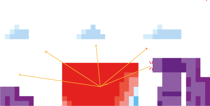
  <figcaption>Fig. 35 Sky view factor</figcaption>
</figure>

<iframe src="https://drive.google.com/file/d/1IY74tjCA-i6ky7r4eXDwXXKygF8T0DDt/preview" width="900px" height="300px"></iframe>
Fig. 36 Distance to ground flowchart

<figure markdown>
  
  <figcaption>Fig. 37 View on greenery</figcaption>
</figure>

<iframe src="https://drive.google.com/file/d/1D3iLna_RNr_O45sSzfyKWXijImskLGda/preview" width="900px" height="300px"></iframe>
Fig. 38 Distance to ground flowchart

<figure markdown>
  {align=left}
  <figcaption>Fig. 40 Distance to Main Entrance</figcaption>
</figure>

<figure markdown>
  {align=left}
  <figcaption>Fig. 41 Distance to Ground</figcaption>
</figure>

<figure markdown>
  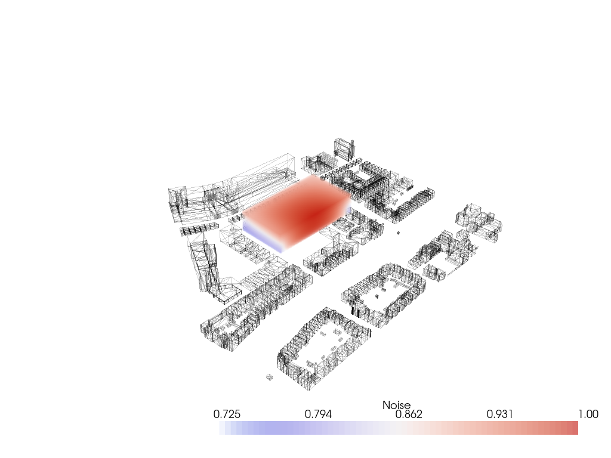{align=left}
  <figcaption>Fig. 42 Noise</figcaption>
</figure>

<figure markdown>
  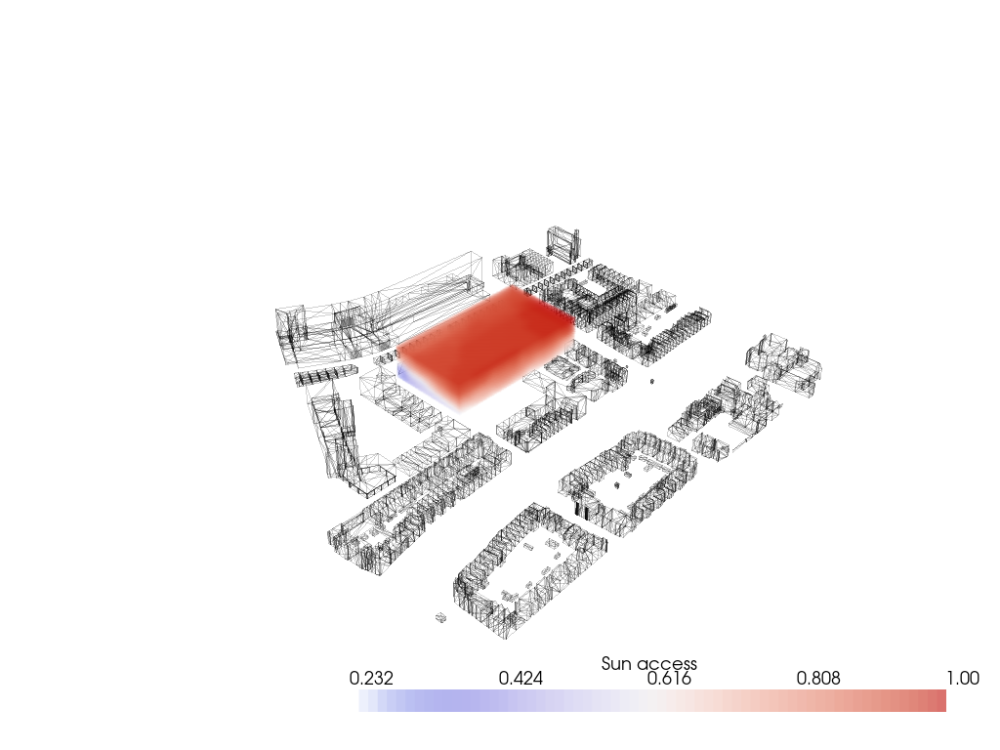{align=left}
  <figcaption>Fig. 43 Sun Access</figcaption>
</figure>

<figure markdown>
  {align=left}
  <figcaption>Fig. 44 Shadow Casting</figcaption>
</figure>

<figure markdown>
  {align=left}
  <figcaption>Fig. 45 View on Greenery</figcaption>
</figure>

<figure markdown>
  {align=left}
  <figcaption>Fig. 46 View on Greenery</figcaption>
</figure>

<figure markdown>
  {align=left}
  <figcaption>Fig. 47 Evaluate voxel</figcaption>
</figure>

<figure markdown>
  {align=left}
  <figcaption>Fig. 48 Original initialization of the agents</figcaption>
</figure>

<figure markdown>
  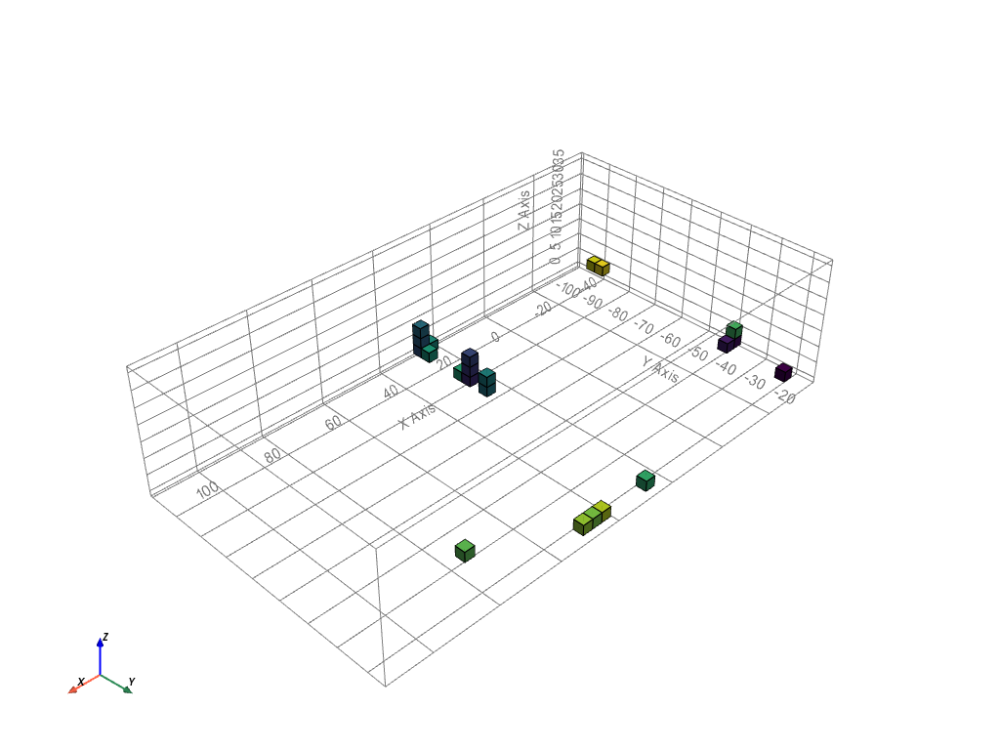{align=left}
  <figcaption>Fig. 49 Improved initialization of the agents</figcaption>
</figure>

<figure markdown>
  {align=left}
  <figcaption>Fig. 50 Change value</figcaption>
</figure>

<figure markdown>
  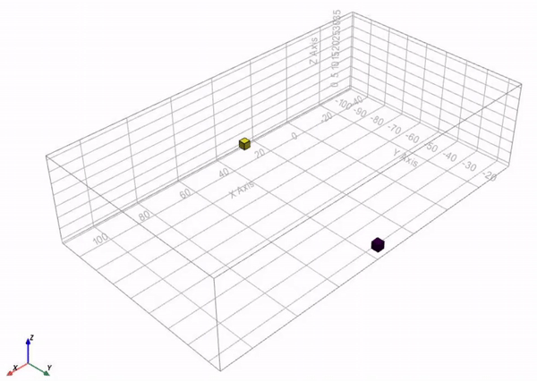
  <figcaption>Fig. 51 Gif of the squareness</figcaption>
</figure>

<figure markdown>
  {align=left}
  <figcaption>Fig. 52 Squareness</figcaption>
</figure>

<figure markdown>
  {align=left}
  <figcaption>Fig. 53 GIF Prevent floating agents</figcaption>
</figure>

<figure markdown>
  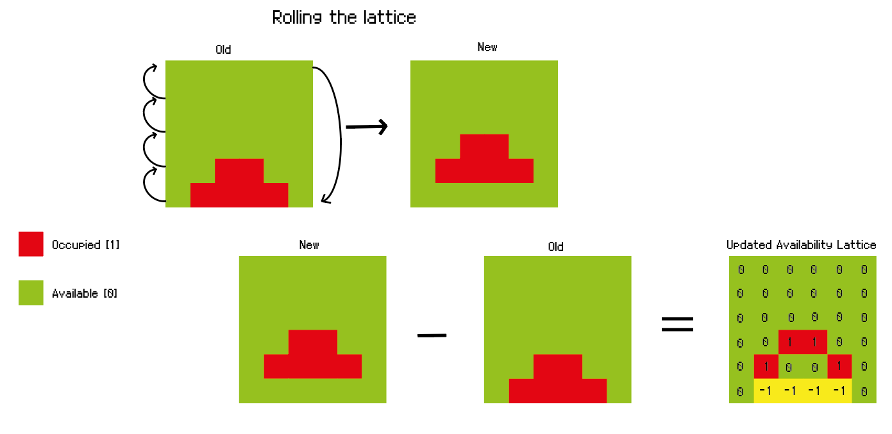{align=left}
  <figcaption>Fig. 54 Prevent floating agents</figcaption>
</figure>

<figure markdown>
  {align=left}
  <figcaption>Fig. 55 Building depth</figcaption>
</figure>

<figure markdown>
  
  <figcaption>Fig. 56 Gif of the building depth (3)</figcaption>
</figure>

<figure markdown>
  
  <figcaption>Fig. 57 Gif of the building depth (6)</figcaption>
</figure>

<figure markdown>
  {align=left}
  <figcaption>Fig. 58 Mass variant, both functions off</figcaption>
</figure>

<figure markdown>
  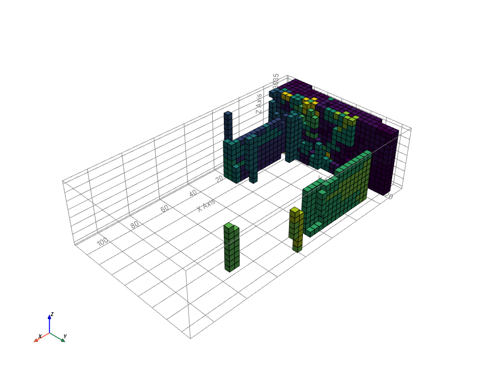{align=left}
  <figcaption>Fig. 59 Mass variant, float function on</figcaption>
</figure>

<figure markdown>
  {align=left}
  <figcaption>Fig. 60 Mass variant, both functions on</figcaption>
</figure>

<figure markdown>
  {align=left}
  <figcaption>Fig. 61 Final mass, float off, depth on</figcaption>
</figure>

<figure markdown>
  {align=left}
  <figcaption>Fig. 62 Student house growth</figcaption>
</figure>

<figure markdown>
  {align=left}
  <figcaption>Fig. 63 Centers of clusters</figcaption>
</figure>

<figure markdown>
  {align=left}
  <figcaption>Fig. 64 Shafts</figcaption>
</figure>

<figure markdown>
  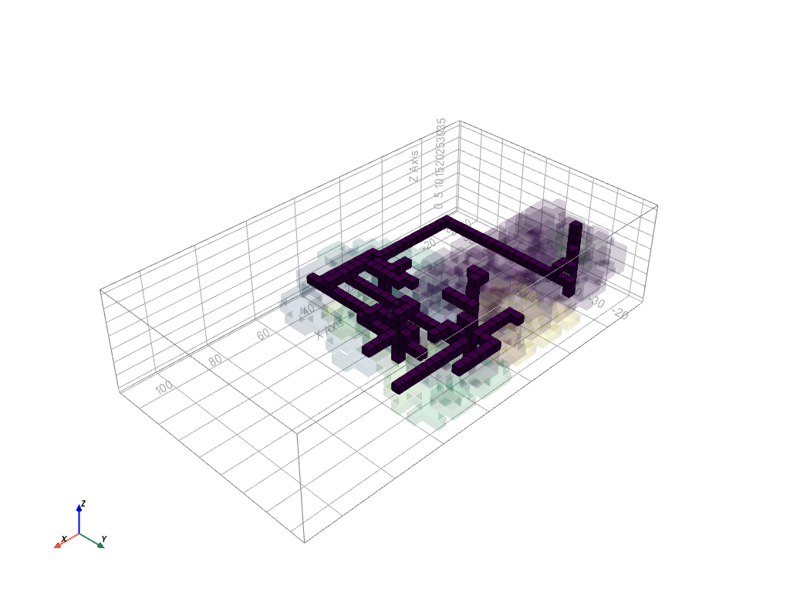{align=left}
  <figcaption>Fig. 65 Paths</figcaption>
</figure>

<figure markdown>
  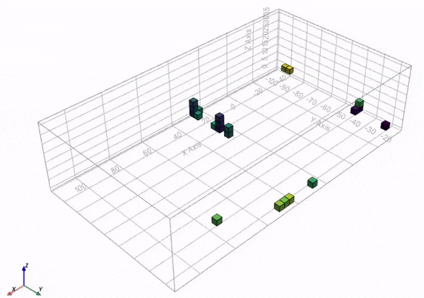{align=left}
  <figcaption>Fig. 66 Gif of the massing</figcaption>
</figure>

<figure markdown>
  {align=left}
  <figcaption>Fig. 67 Final mass</figcaption>
</figure>

<figure markdown>
  {align=left}
  <figcaption>Fig. 68 Legend 1</figcaption>
</figure>

<figure markdown>
  {align=left}
  <figcaption>Fig. 69 Legend 2</figcaption>
</figure>

<figure markdown>
  {align=left}
  <figcaption>Fig. 70 Legend 3</figcaption>
</figure>

<figure markdown>
  {align=left}
  <figcaption>Fig. 71 Floor plan gif</figcaption>
</figure>

<figure markdown>
  {align=left}
  <figcaption>Fig. 72 Top view of the building in context with the city</figcaption>
</figure>

<iframe src="https://drive.google.com/file/d/1ktS7Xo1TA7JSXAQctYEvab5elJg8NCov/preview" width="900px" height="300px"></iframe>
Fig. 73 Flow diagram notebooks

<figure markdown>
  {align=left}
  <figcaption>Fig. 74 Facade tiles</figcaption>
</figure>

<figure markdown>
  {align=left}
  <figcaption>Fig. 75 Eave tiles</figcaption>
</figure>

<figure markdown>
  {align=left}
  <figcaption>Fig. 76 Interior floor tiles</figcaption>
</figure>

<figure markdown>
  {align=left}
  <figcaption>Fig. 77 Interior corner tiles</figcaption>
</figure>

<figure markdown>
  {align=left}
  <figcaption>Fig. 78 Roof tiles</figcaption>
</figure>

<figure markdown>
  {align=left}
  <figcaption>Fig. 79 Balcony tiles</figcaption>
</figure>

<figure markdown>
  {align=left}
  <figcaption>Fig. 80 Example combination</figcaption>
</figure>

<iframe src="https://drive.google.com/file/d/1h6SMtFmjkWi_0aQdZR8dSdFcPD2UwpUG/preview" width="900" height="500px"></iframe>
Fig. 81 Flowchart architectural floor plan generator

<iframe src="https://drive.google.com/file/d/1IkZJ38FgJL6EoMk5fy0FHdbkC-CY1pDq/preview" width="900" height="500px"></iframe>
Fig. 82 Catalogue

<figure markdown>
  {align=left}
  <figcaption>Fig. 83 Catalogue game in steps (Living Room)</figcaption>
</figure>

<figure markdown>
  {align=left}
  <figcaption>Fig. 84 Catalogue game in steps (Kitchen)</figcaption>
</figure>

<figure markdown>
  {align=left}
  <figcaption>Fig. 85 Catalogue game in steps (Café)</figcaption>
</figure>

<figure markdown>
  {align=left}
  <figcaption>Fig. 86 Floor plan living, laundry, bedroom and private toilet</figcaption>
</figure>

<figure markdown>
  {align=left}
  <figcaption>Fig. 87 Floor plan with hidden corridors of living, laundry, bedroom and private toilet</figcaption>
</figure>

<figure markdown>
  {align=left}
  <figcaption>Fig. 88 Floor plan library, shops, kitchen and gym</figcaption>
</figure>

<figure markdown>
  {align=left}
  <figcaption>Fig. 89 Floor plan with hidden corridors of library, shops, kitchen and gym</figcaption>
</figure>

<figure markdown>
  {align=left}
  <figcaption>Fig. 90 Floor plan restaurant, public toilet and workspaces</figcaption>
</figure>

<figure markdown>
  {align=left}
  <figcaption>Fig. 91 Floor plan with hidden corridors of restaurant, public toilet and workspaces</figcaption>
</figure>

<figure markdown>
  {align=left}
  <figcaption>Fig. 92 Render birds eye view</figcaption>
</figure>

<figure markdown>
  {align=left}
  <figcaption>Fig. 93 Render North</figcaption>
</figure>

<figure markdown>
  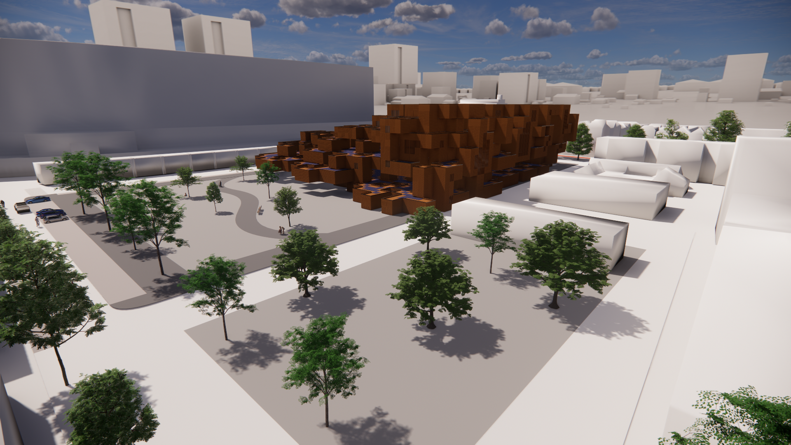{align=left}
  <figcaption>Fig. 94 Render East</figcaption>
</figure>

<figure markdown>
  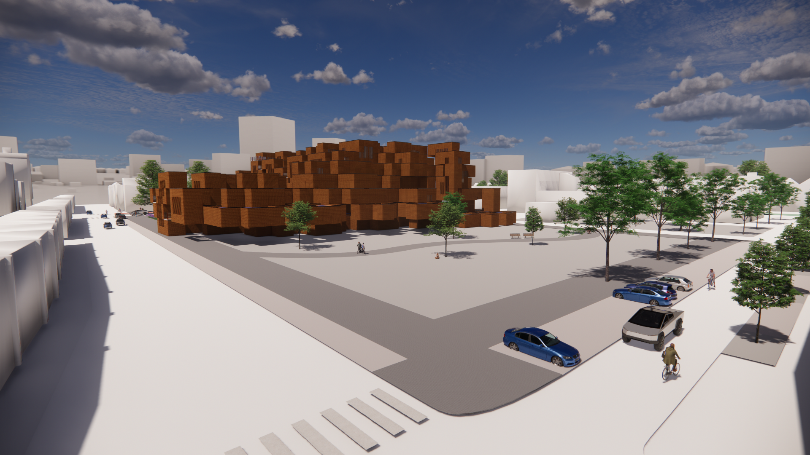{align=left}
  <figcaption>Fig. 95 Render South</figcaption>
</figure>

<figure markdown>
  {align=left}
  <figcaption>Fig. 96 Render West</figcaption>
</figure>

<figure markdown>
  {align=left}
  <figcaption>Fig. 97 Render NW</figcaption>
</figure>

<figure markdown>
  {align=left}
  <figcaption>Fig. 98 Render South birds eye</figcaption>
</figure>

<figure markdown>
  {align=left}
  <figcaption>Fig. 99 Render Top</figcaption>
</figure>

<figure markdown>
  {align=left}
  <figcaption>Fig. 100 Render Balcony</figcaption>
</figure>

<figure markdown>
  {align=left}
  <figcaption>Fig. 101 Render Context</figcaption>
</figure>

<figure markdown>
  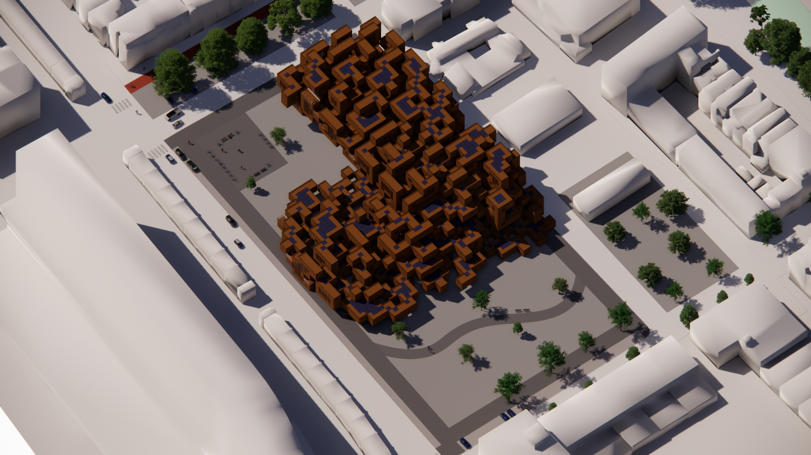{align=left}
  <figcaption>Fig. 102 Render Context South</figcaption>
</figure>

<figure markdown>
  {align=left}
  <figcaption>Fig. 103 Render Context East</figcaption>
</figure>

<figure markdown>
  {align=left}
  <figcaption>Fig. 104 Render Context North</figcaption>
</figure>

<figure markdown>
  {align=left}
  <figcaption>Fig. 105 Render close up</figcaption>
</figure>

<figure markdown>
  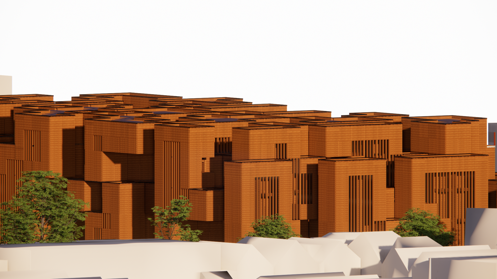{align=left}
  <figcaption>Fig. 106 Render close up</figcaption>
</figure>

<figure markdown>
  {align=left}
  <figcaption>Fig. 107 Render close up</figcaption>
</figure>

<figure markdown>
  
  <figcaption>Fig. 108 Reflection visualized, showing the division between public and private.</figcaption>
</figure>

<figure markdown>
  
  <figcaption>Fig. 109 Greenery</figcaption>
</figure>

<figure markdown>
  
  <figcaption>Fig. 110 Noise</figcaption>
</figure>

<figure markdown>
  
  <figcaption>Fig. 111 Sun access. (Residential area is marked in green in the pictures above)</figcaption>
</figure>

<figure markdown>
  
  <figcaption>Fig. 112 Highline, New York</figcaption>
</figure>

<figure markdown>
  
  <figcaption>Fig. 113 Top view of the context, showing connectivity with main roads</figcaption>
</figure>

<figure markdown>
  {align=left}
  <figcaption>Fig. 114 Poster</figcaption>
</figure>