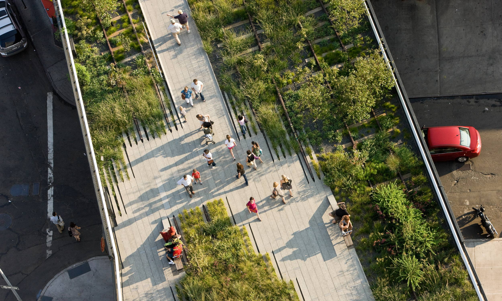
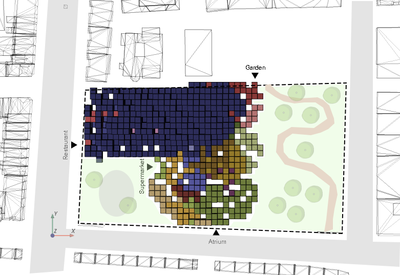
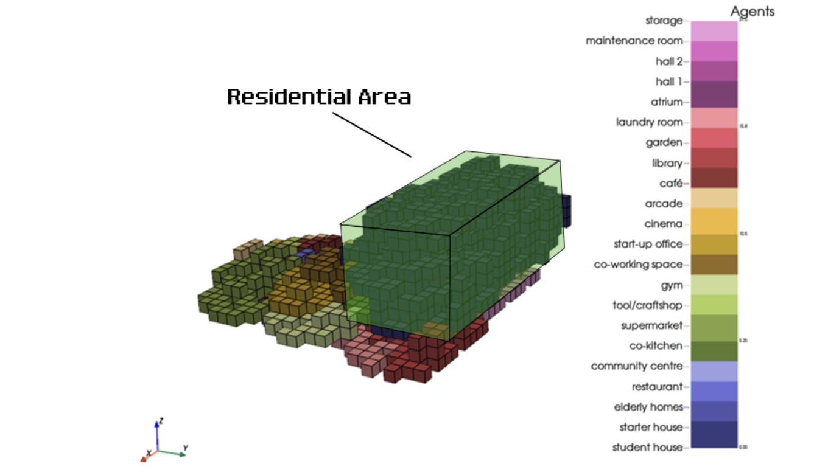
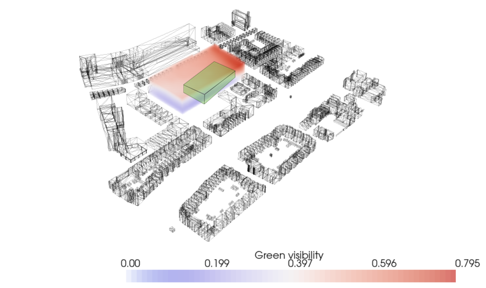
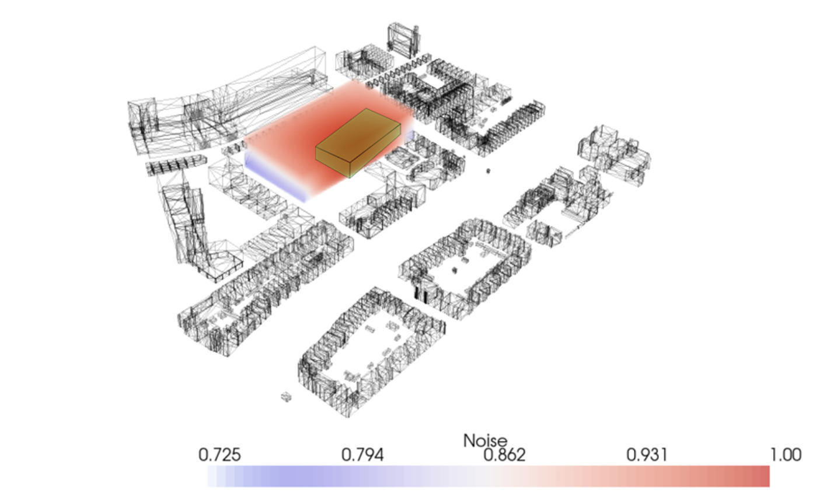

# Reflection

### **Reflection on Design Goals**

At the start of our project we set up a list of design goals with which we could measure if our building has become the building we wanted to create. These goals mostly had to deal with external features which could improve the building site. Due to time constraints we haven’t fully looked back at these goals. We will now quickly reflect on the goals and give our recommendations for future work on the building.

**Using the existing surrounding structures and creating a new function/environment**

The existing train track next to the building site would have been a great structure to implement in our final mesh somehow. Unfortunately, we haven’t had the time to further exploit this idea. We recommend for future work to look into ways to combine the two structures. This could be in the form of a bridge or overpass connecting the Hub with the train track. Or you could also turn the top level of the train tracks into a park, just like the High Line Park in New York City. A better analysis into other existing structures in the neighborhood that could improve the site would also be a recommendation for future studies.

<figure markdown>
  
  <figcaption>Fig. 112 Highline, New York</figcaption>
</figure>

**Integrating surrounding wall paintings on the site**

This was a mostly social aspect of the project which we haven’t incorporated. The idea was to mimic the existing wall paintings from the original neighborhood and surrounding buildings as a sort of homage to the characteristics of Rotterdam North. Instead we have gone with our own design which kind of stands out in the neighborhood. A tip for coming years could be to look at the buildings in the area and to pay tribute to the history and design of those buildings.

**Keeping existing businesses on the site and in the building**

This is something that we as project participants haven’t actually got any influence over. Of course in theory, if the building ever gets built, the existing businesses could move their offices to our new building. Since our building hosts room for so many different facilities there is a spot for every owner to set up shop.

**Expanding and connecting surrounding green structures to create qualitative greenery**

This goal has been met. We looked at the greenery analysis and incorporated more green spaces at the side of our building site that was lacking in this area. In our final render you could see this implementation more clearly.

**Creating an accessible connection between the building and the surrounding area**

Due to the computational nature of our design, all the rooms in our building are optimized as best as possible to their own needs. As a result this led to rooms that prefer to be at the outside of the building site, to be actually on that side (as can be seen in the overhead view below). Because our building is so well connected with the main roads of the neighborhood, one can argue that this goal has been met as well. A recommendation for next year might be to look more into facilitating public transportation hubs around the building site or to find out a different solution in order to create a better connection with public transit in the area.

<figure markdown>
  
  <figcaption>Fig. 113 Top view of the context, showing connectivity with main roads</figcaption>
</figure>

### **Reflection on design principles**

While looking at the analysis for noise pollution, sun accessibility and view on greenery we can conclude that the residential voxels are mostly clustered at the side of the building site where the values for these analyses are the highest. The final building also has a very high porosity, which lets through a lot of sunlight for every voxel. This makes sure that every room in the building receives the desired amount of sun light. A possible improvement on this goal could be to increase the view on greenery on the building site itself. The external greenery is quite on the lower side when we look at the analysis.

<figure markdown>
  
  <figcaption>Fig. 108 Reflection visualized, showing the division between public and private.</figcaption>
</figure>

<figure markdown>
  
  <figcaption>Fig. 109 Greenery</figcaption>
</figure>

<figure markdown>
  
  <figcaption>Fig. 110 Noise</figcaption>
</figure>

<figure markdown>
  
  <figcaption>Fig. 111 Sun access. (Residential area is marked in green in the pictures above)</figcaption>
</figure>

Reflecting back on the generated floor plan, we can see that the separation between public and private places has been established. All the residential voxels are at the top half of the building and also at the upper levels of the building. The public spaces are at the bottom half of the building and mostly on the ground floor. In our opinion this design goals has been met. The public spaces can be seen inside of the box in the images.

The final floor plan generator we have conceptualized can be considered as our most modular aspect of the building. Not only does every interior tile fit inside the voxels, they can also easily be swapped out and reorganized. This means that the function of a room can be changed with ease, without major adjustments to the shape of the building. 

### **Growth process**
* In our project we used the following order in the massing part: 
    1.	Initialize agents
    2.	Grow agents
    3.	Find average voxel per agent
    4.	Grow shafts
    5.	Grow corridors

This is one of the options to do this process. However, this is not the way to get an optimal result. A better way would be to create all the functions and put them in a for loop and thereby updating the manifold distance fields. When the complete process as described above has been completed once, the manifold distance fields can be updated by using the corridors as walking routes. Than the process can be run again, every time updating the result. By doing this, the manifold distances are more related to the real world and thereby create a better result. The downside to this method is that is takes a lot of computational power, which might not be possible.

### **Recommendations **
In this project we started implementing new aspects in order to improve the process. We made a few steps in the right direction, however these new elements still need a lot of improvement. 

We incorporated a floorplan generator to create floorplans in a systematic way and thereby guide the forming floorplans. The floorplan generator already includes furniture, hidden corridors and wall borders. In order to make the catalogue complete, also windows should be included. The next step in this improvement is to link the floorplans with the Agent Based Model growth. When the floorplans are somehow included in the growth process, spaces will be created that can fit the floorplans and floorplans will fit the spaces. The placement of windows can than be guided as well.

Next to that, we added a new preference to the program of requirements, view on greenery. We created this field by looking at the existing greenery in the surrounding. However, later in the project we added some greenery on the plot. For future projects it is recommended to find a way to incorporate the new greenery the creation of the field. 

Another aspect we have been experimenting with is the use of limiting the building depth. In our configuration we used a maximum building depth of 3 voxels in the x- or y-direction. The result is a Swiss cheese building, it has holes at every floor level. The goal of this behaviour was to get enough light and sun in the building. The holes which are created in the middle of the building will not let any sun through, because there are occupied voxels above the empty voxels. The behaviour should be adapted in order to take care of this problem.

Lastly, we wanted to created building which was connected to the ground. Therefore we added a new behaviour which prevented the agents from floating. When we included this behaviour in the growth process, we noticed that the agents tended to go up much more than when we left this behaviour out of the process. We could not figure out what the exact reason is for this phenomenon. It might be that in the first iteration the agent above is best and the next iteration it cannot grow to the side anymore, so it will occupy the voxel above again. To adapt this behaviour in future projects, there need to be taken a good look at the logic behind this process. 