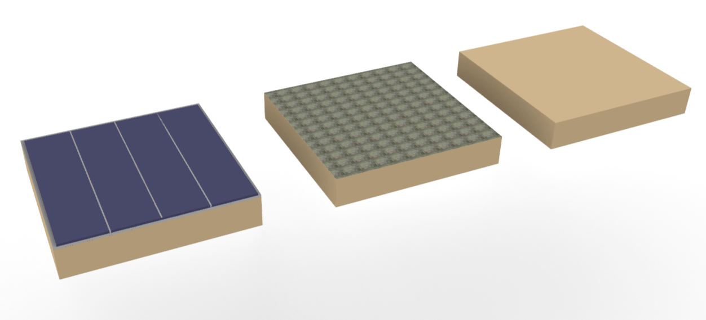
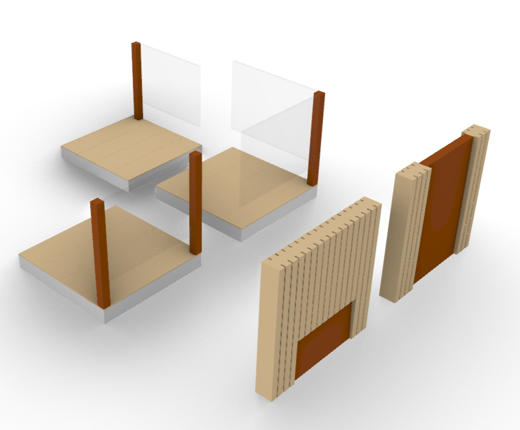
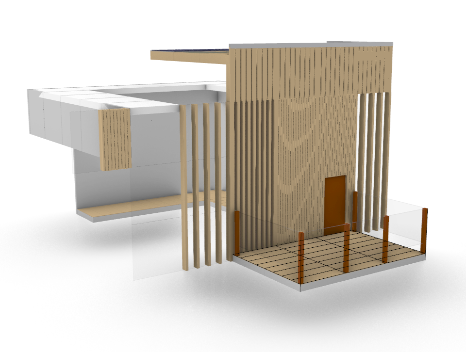
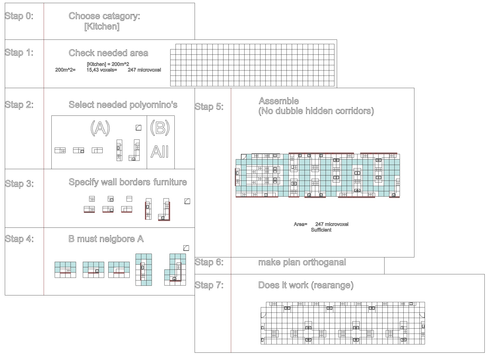
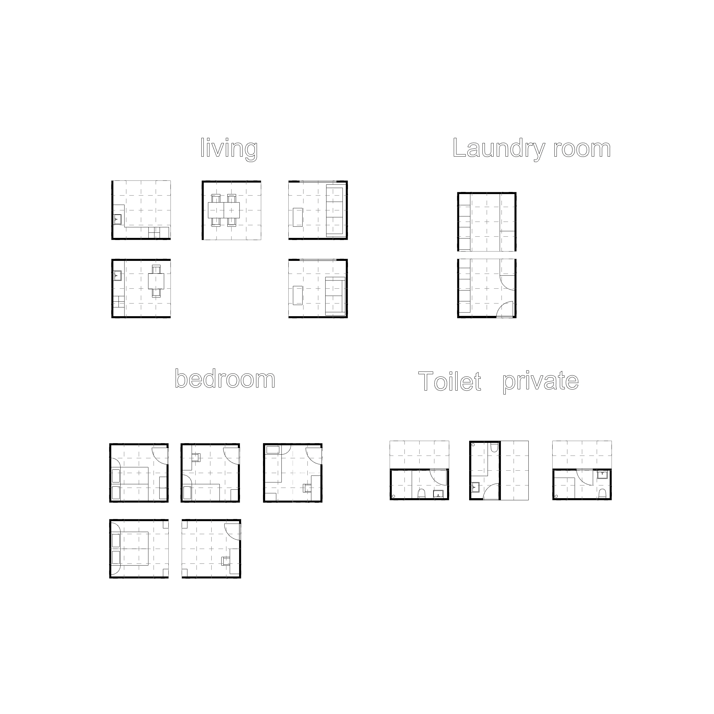
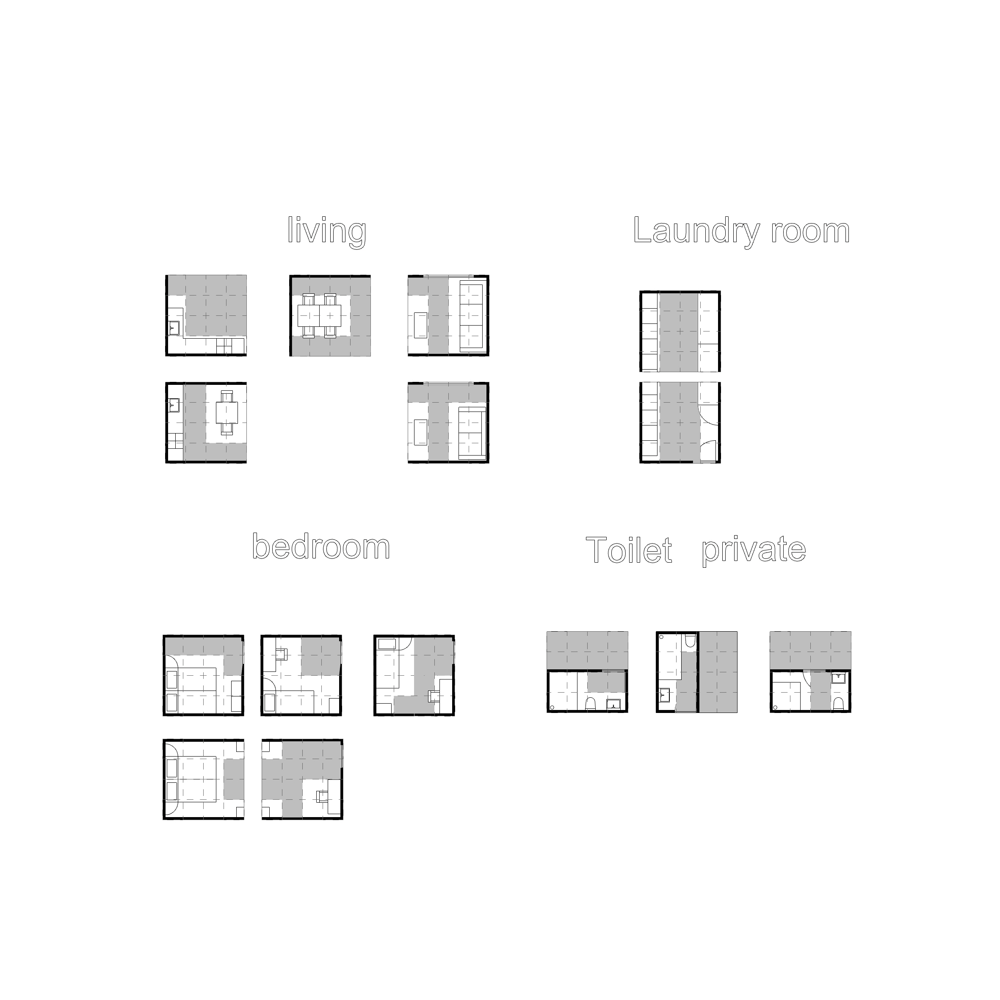

# **Forming: process**

### Architectural tiles
> For the interior and exterior design we made a tile set which is used in the Boolean Marching Cube (Not all different types of tiles are used in the final renders). The materials chosen for our tiles are wood and glass. We have chosen these materials to create a more open look and integrate a more sustainable and modular materialization for our building. 
Using wood has a couple of advantages besides designing a building with a lower carbon footprint. An advantage of wood is its acoustic qualities. Wood has acoustic properties that make it ideal for minimizing echo in living and workspaces. Wood absorbs sound, rather than reflecting it, this quality aids our design goal of reducing sound pollution in our building. Other advantages of using wood are the improvement of the overall air quality and the low-thermal conductivity.
The tile set includes different categories:

* Façade tiles: based on the amount of light that has to enter the building. The façade tiles are made by mounting wooden slats vertically next to each other. These slats reach all the way up to the eaves of the building.  
* Eave tiles: are designed in a similar way as the façade tiles. The wooden slats from the façade tiles continue in one line in the eave tiles. 
* Interior floor tiles: made with a wooden screed.
* Interior ceiling tiles: have a surface finish made of plaster.
* Interior corner tiles: include the wall tiles and connect them to the ceiling or floor tiles.
* Roof tiles: covered with solar panels, green patches and wooden tiles.
* •	Balcony tiles: includes door elements that takes up 2 tiles and a glass railing element that defines the floor area of each balcony.

In the image below, You see an example on how these different tiles connect with each other and create the internal and external layout of the building.

<figure markdown>
  {align=left}
  <figcaption>Fig. 74 Facade tiles</figcaption>
</figure>

> Below are the tiles used for the corners of the building.
<figure markdown>
  {align=left}
  <figcaption>Fig. 75 Eave tiles</figcaption>
</figure>

> Below are the tiles used for the floor of the building.
<figure markdown>
  {align=left}
  <figcaption>Fig. 76 Interior floor tiles</figcaption>
</figure>

> Below are the tiles used for the interior corners of the building.
<figure markdown>
  {align=left}
  <figcaption>Fig. 77 Interior corner tiles</figcaption>
</figure>

> Below are the tiles used for the roof of the building, consisting of three variants; solar panels, green patches and wooden tiles.
<figure markdown>
  {align=left}
  <figcaption>Fig. 78 Roof tiles</figcaption>
</figure>

> Below are the tiles used for the balconies of the building.
<figure markdown>
  {align=left}
  <figcaption>Fig. 79 Balcony tiles</figcaption>
</figure>

> Shown here is an example of a combination of tiles resulting in a room with a balcony.
<figure markdown>
  {align=left}
  <figcaption>Fig. 80 Example combination</figcaption>
</figure>

### **Flowchart architectural floor plan generator**
> We also made a Decision tree to generate architectural floorplans. The decision tree generates floorplans for any room specified in the catalogue. The catalogue, which can be found in the next paragraph, specifies which room contains which furniture and each and every possible type of hidden path. The furniture and hidden paths are based on a unit of 1 microvoxel (90/90/54 cm).

The use of the floorplan catalogue can make it easier to change the floorplans in later stages. Therefore it helps to become a bit more modular. 

<iframe src="https://drive.google.com/file/d/1h6SMtFmjkWi_0aQdZR8dSdFcPD2UwpUG/preview" width="900" height="500px"></iframe>
Fig. 81 Flowchart architectural floor plan generator

### **Catalogue**
> To make a more concrete representation on how the flowchart would work we made a protype catalogue. In this simple catalogue each room within our building is named with its accompanying hidden paths and furniture. Note that for each space all possible hidden tiles are made available according to the amount of furniture needed and the maximum area needed.
<iframe src="https://drive.google.com/file/d/1IkZJ38FgJL6EoMk5fy0FHdbkC-CY1pDq/preview" width="900" height="500px"></iframe>
Fig. 82 Catalogue

### **Catalogue roadmap**
> Below we made a couple of examples on how our floorplan generator could work. 

* Step 0:  Check catalogue 🡪 Choose space that needs to be defined
* Step 1:  Check area needed in program of requirements
    * Calculate how many microvoxels are needed
* Step 2:  Check catalogue 🡪 Choose furniture and accompanying hidden path
* Step 3:  Specify wall borders of furniture
    * (Furniture with wallborders must be placed next to a wall on the specified border OR must be placed next to another wallborder of a another set of furniture)
* Step 4:  Furniture needs to be surrounded by hidden paths except for the borders.
* Step 5:  Assemble floorplan randomly.
    * Check if area furniture + hidden paths = area specified in program of requirements
    * Add or subtract hidden paths accordingly
* Step 6:  Make plan orthogonal (specify X & Y amount of microvoxels)
* Step 7:  Evaluate, does it work? Rearrange if necessary according to preference.

<figure markdown>
  {align=left}
  <figcaption>Fig. 83 Catalogue game in steps (Living Room)</figcaption>
</figure>

<figure markdown>
  {align=left}
  <figcaption>Fig. 84 Catalogue game in steps (Kitchen)</figcaption>
</figure>
<figure markdown>
  {align=left}
  <figcaption>Fig. 85 Catalogue game in steps (Café)</figcaption>
</figure>

### **Floor plans**
> The following floorplans are generated with the help of the floorplan generator. For every floorplan a certain amount of voxels is predefined. Each voxel is subdivided further into a microvoxel grid. By coloring the hidden paths for each empty microvoxel, you separate the furniture from the possible hidden paths. In the next set of floorplans each modular floorplan is shown normally and once again with the hidden paths drawn in.

<figure markdown>
  {align=left}
  <figcaption>Fig. 86 Floor plan living, laundry, bedroom and private toilet</figcaption>
</figure>

<figure markdown>
  {align=left}
  <figcaption>Fig. 87 Floor plan with hidden corridors of living, laundry, bedroom and private toilet</figcaption>
</figure>

<figure markdown>
  {align=left}
  <figcaption>Fig. 88 Floor plan library, shops, kitchen and gym</figcaption>
</figure>

<figure markdown>
  {align=left}
  <figcaption>Fig. 89 Floor plan with hidden corridors of library, shops, kitchen and gym</figcaption>
</figure>

<figure markdown>
  {align=left}
  <figcaption>Fig. 90 Floor plan restaurant, public toilet and workspaces</figcaption>
</figure>

<figure markdown>
  {align=left}
  <figcaption>Fig. 91 Floor plan with hidden corridors of restaurant, public toilet and workspaces</figcaption>
</figure>