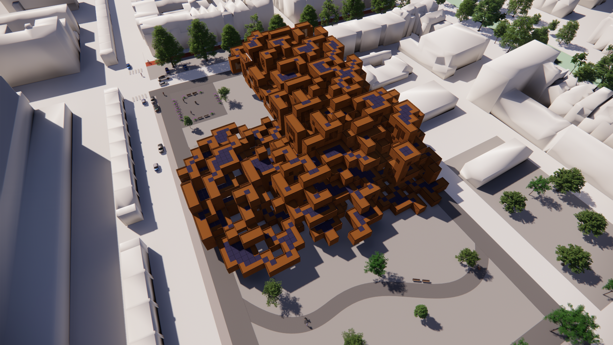
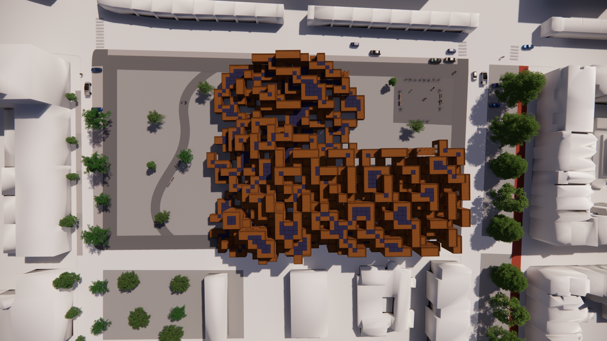

# **Forming: product**

### ** RENDER**
> Here the final renders of the project can be seen. 

### Render birds eye view
<figure markdown>
  {align=left}
  <figcaption>Fig. 92 Render birds eye view</figcaption>
</figure>

### Render North side
<figure markdown>
  {align=left}
  <figcaption>Fig. 93 Render North</figcaption>
</figure>

### Render East side
<figure markdown>
  {align=left}
  <figcaption>Fig. 94 Render East</figcaption>
</figure>

### Render South side
<figure markdown>
  {align=left}
  <figcaption>Fig. 95 Render South</figcaption>
</figure>

### Render West side
<figure markdown>
  {align=left}
  <figcaption>Fig. 96 Render West</figcaption>
</figure>

### Render NW side
<figure markdown>
  {align=left}
  <figcaption>Fig. 97 Render NW</figcaption>
</figure>

### Render South birds eye
<figure markdown>
  {align=left}
  <figcaption>Fig. 98 Render South birds eye</figcaption>
</figure>

### Render Top
<figure markdown>
  {align=left}
  <figcaption>Fig. 99 Render Top</figcaption>
</figure>

### Render Balcony
<figure markdown>
  {align=left}
  <figcaption>Fig. 100 Render Balcony</figcaption>
</figure>

### Render Context
<figure markdown>
  {align=left}
  <figcaption>Fig. 101 Render Context</figcaption>
</figure>

### Render Context South
<figure markdown>
  {align=left}
  <figcaption>Fig. 102 Render Context South</figcaption>
</figure>

### Render Context East
<figure markdown>
  {align=left}
  <figcaption>Fig. 103 Render Context East</figcaption>
</figure>

### Render Context North
<figure markdown>
  {align=left}
  <figcaption>Fig. 104 Render Context North</figcaption>
</figure>

### Render close up
<figure markdown>
  {align=left}
  <figcaption>Fig. 105 Render close up</figcaption>
</figure>
<figure markdown>
  {align=left}
  <figcaption>Fig. 106 Render close up</figcaption>
</figure>
<figure markdown>
  {align=left}
  <figcaption>Fig. 107 Render close up</figcaption>
</figure>