# **Massing: process**
____
## ** Introduction **
> In this section the growth of the ABM (agent based model) will be discussed. There are several special behaviours which were created to guide the growth and to get a configuration which matches the design goals best. For every behaviour a function is created, tested and evaluated. In the end different configurations will be discussed with respect to the design goals, they all use a different combination of behaviours. 

### **Evaluate voxels**
> Before the process of growing the voxels can start, we need a way to evaluate all the voxels in order to know where every agent wants to grow. That is the purpose of this function. The fields, created in the configuring part, will be combined with the preferences  from the program of requirements. For the to be evaluated voxels the original value from a particular field will be raised by the preference to get the new value. The value of each voxel will be different for every agent and different for each iteration.
<figure markdown>
  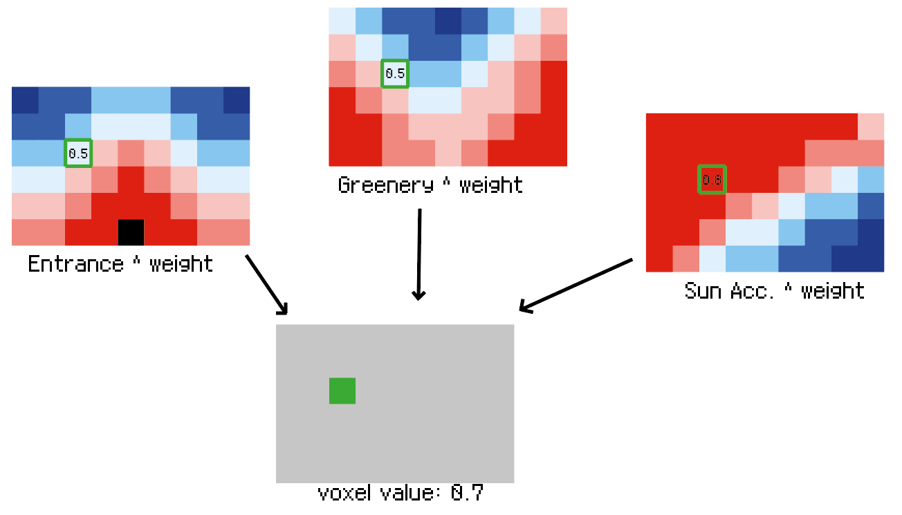{align=left}
  <figcaption>Fig. 47 Evaluate voxel</figcaption>
</figure>

** Pseudo code**
``` python title="Evaluate_voxels.py" linenums="1"
Input: location of the to be evaluated voxels, fields, preferences

Create a list full of ones with the same length as the amount of voxels to be evaluated
For each agent:
  Find the raw value of these voxels in the fields
  Raise these values with the weight of each preference
  Multiply all the new values with each other to get the final value
Return the final values

Output: new values of evaluated voxels
```

### **Seed allocation**
> We started the massing part by initializing the agents. We used the function to evaluate voxels. At first the agents are placed at the spot where they feel most comfortable, see the first image. Furthermore, we added another feature to the initialization part. When the agents are at the place with the highest values, they are moved down to ground level, which can be seen in the second image. This is done to discourage too many floating agents later in the process.

<figure markdown>
  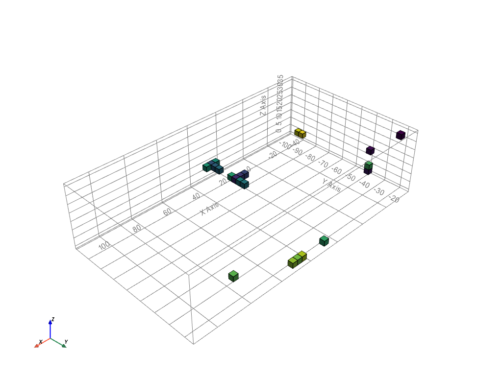{align=left}
  <figcaption>Fig. 48 Original initialization of the agents</figcaption>
</figure>

<figure markdown>
  {align=left}
  <figcaption>Fig. 49 Improved initialization of the agents</figcaption>
</figure>

** Pseudo code**
``` python title="Initialization_agents.py" linenums="1"
Input: voxelized_envelope.csv (high res), fields, program of requirement

Initialize the empty occupation lattice (full of -1)
For every agent id and the agent preferences:
  Create a preference lattice for every agent
  Raise the value of every field by the weight given in the program
  Select the voxel with the highest value
  Move the voxel to ground level, to prevent floating parts
  Change the value in the occupation and availability lattice

Output: Initialized agents (occupation lattice and availability lattice)
```

### ** Change value**
> This function is created to occupy voxels or to leave voxels. In the beginning the agents will eat voxels. When the maximum amount of voxels is reached, the values of the neighbours is are compared with the internal voxels. When the neighbour has a value which is 10% higher than the internal voxel, one will be let go and the other one will be occupied. This all happens within the same function. 

<figure markdown>
  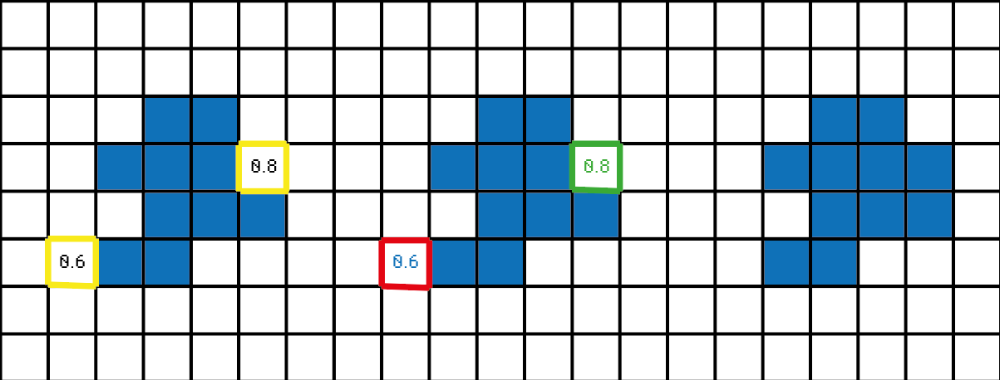{align=left}
  <figcaption>Fig. 50 Change value</figcaption>
</figure>

** Pseudo code**
``` python title="Change_value.py" linenums="1"
Input: occupation lattice, availability lattice, location, agent location list, new id

If the voxel needs to get occupied (new id > -1 in occupation lattice):
  Add the location to the list of agent locations
  Change the value of the availability lattice to occupied (= 0)
Else (voxel needs to be removed):
  Remove the location from the agent locations list
  Change the value of the availability lattice to unoccupied (= 1)
  Change the value of the occupation lattice to the new id

Output: new occupation lattice, new availability lattice, location, agents location list
```

## ** Special behaviours**

### ** Squareness**
> Squareness is a behaviour we created to encourage the agents to grow in rectangular shapes to create usable spaces. When a neighbour exists for multiple voxels it will increase the squareness and therefore its value will be raised.

This gif illustrates the effect of this behaviour. It can be seen that the agents grow in a rectangular shape.
The behaviour works the way it was supposed to work, so there are no recommendations for improvement on this behaviour.

<figure markdown>
  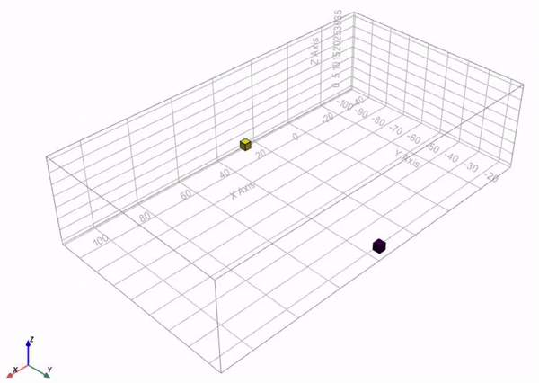
  <figcaption>Fig. 51 Gif of the squareness</figcaption>
</figure>
<figure markdown>
  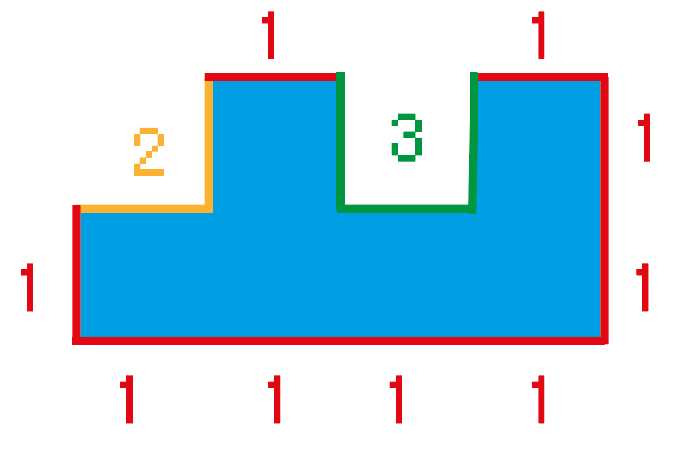{align=left}
  <figcaption>Fig. 52 Squareness</figcaption>
</figure>

** Pseudo code**
``` python title="Squareness.py" linenums="1"
Input: 1d location of the free neighbours, squareness weight

use the numpy unique function to:
return how many times each neighbour is in the list
return what the first unique index is of each neighbour
for every unique free neighbour:
  evaluate each agent with the “evaluate_voxel” function
  raise the squareness weight by the amount of times the neighbour exist - 1
  multiply the old value with the calculated squareness value

output: value of each free neighbour
```

### Prevent floating agents
> This behaviour is created to prevent agents from floating in the air in order to create a more realistic building. By only making the voxels available which have voxels beneath, the agents can only grow at places which are connected to the ground

This example is made with the same preferences as in the squareness example. The effect of this behaviour can be clearly seen. None of the agents are floating in the air, they only go up or to the side, that means the behaviour works as expected. However, the agents tend to go up whereas in the previous example of the squareness, the agents did not want to go up. To improve this behaviour it is necessary to find out why this is happening and thereby how to improve it such that the agents do not only want to go up.

<figure markdown>
  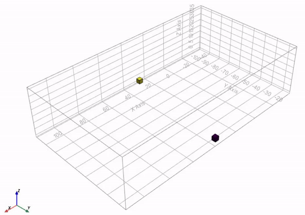{align=left}
  <figcaption>Fig. 53 GIF Prevent floating agents</figcaption>
</figure>

<figure markdown>
  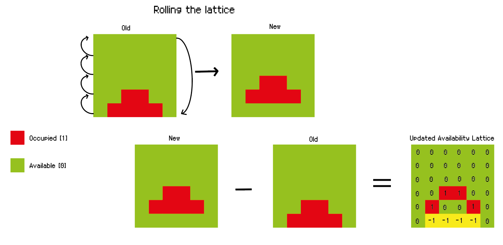{align=left}
  <figcaption>Fig. 54 Prevent floating agents</figcaption>
</figure>

** Pseudo code**
``` python title="Prevent_floating.py" linenums="1"
Input: occupation lattice

Retrieve the location of the occupied voxels (id > -1)
Move the occupied voxels one place up
Subtract the new occupation lattice from the old occupation lattice
Now only the voxels with voxels beneath are available (id = 1 in avail_lattice)
Set the voxels on ground level which have now the value 0 (unoccupied) to 1 so the agent can grow to the sides as well.

Output: new availability lattice
```

### Limiting building depth
> This behaviour limits the building depth in the horizontal directions. This is done to get as much light in the building as possible and thereby achieve one of the design principles, creating good living conditions. The skylight and sunlight hits the building at an angle and therefore it cannot reach too far in a space.

<figure markdown>
  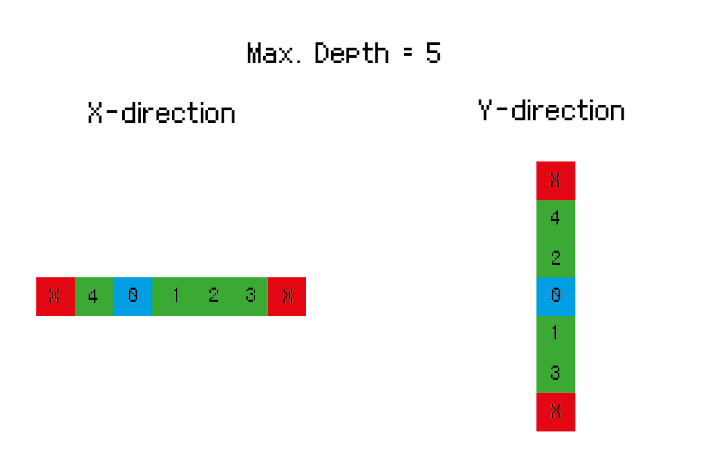{align=left}
  <figcaption>Fig. 55 Building depth</figcaption>
</figure>

In the two gifs beneath, you can see how this behaviour works on the growth of the agents. For the first simulation a maximum building depth of 3 voxels is used. It can be seen that there are never more than 3 voxels next to each other in the x- or y-direction.
The second simulation uses a maximum building depth of 6 voxels. In this example you can clearly see the effect of this behaviour. The yellow agent wants to grow towards the purple agent, but it cannot grow in one straight line, because then it will exceed the building depth. Therefore it grows to the side at some places.

<figure markdown>
  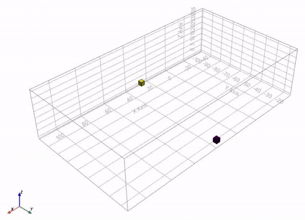
  <figcaption>Fig. 56 Gif of the building depth (3)</figcaption>
</figure>
<figure markdown>
  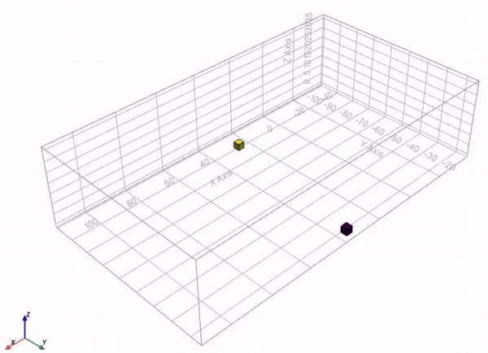
  <figcaption>Fig. 57 Gif of the building depth (6)</figcaption>
</figure>

This behaviour can be optimized in future projects. At this moment the function looks at the x- and y-direction separately. However, when you look at the second example, one row of voxels of more than 6 voxels would not be a problem for the sun access. It becomes a problem when the maximum building depth is reached in both directions, this should be taken into account when improving this behaviour.

** Pseudo code**
``` python title="Building_depth.py" linenums="1"
Input: occupation lattice, availability lattice, max. building depth

Create stencils to check the different directions
Create conditions for each direction
In the x-direction there can’t be more voxels next to each other than the max building depth
In the y-direction there can’t be more voxels next to each other than the max building depth

Output: new availability lattice
```

### ** Final mass**
> Before choosing the final mass, we experimented with the use of different combinations of behaviours. We ran the simulation multiple times to see the effect of some specific behaviours, especially the function which prevents floating parts and the function on limiting the building depth. The results are shown below and evaluated.

### Behaviours and expectations
### Both off:
The first configuration is the result of the simulation with both functions turned off. This configuration consists out of one big mass with for a big part a horizontal roof. This makes it difficult for the sun to penetrate the middle of the building. One of the design principles was to create a good living condition with as much light as possible. This configuration does not meet this criteria. 

<figure markdown>
  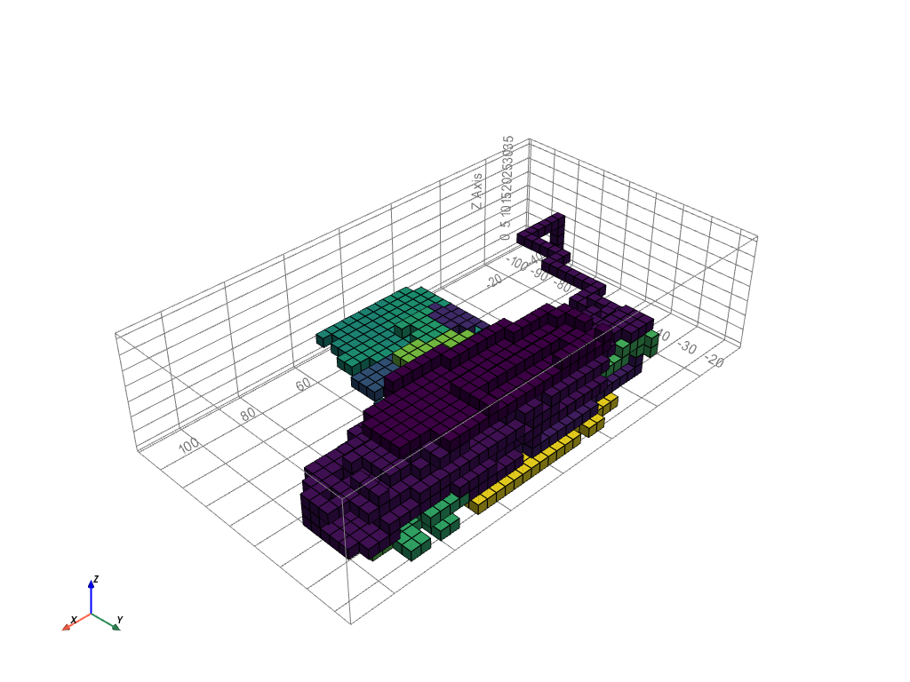{align=left}
  <figcaption>Fig. 58 Mass variant, both functions off</figcaption>
</figure>

### No float function:
In the second configuration the behaviour which prevents floating agents is turned on. This function has the effect that all the agents want to go up and therefor it creates a massive wall of about 44 metres high. The building will cast too much shadow on the neighbours, as it is outside the solar envelope, and is therefore not an option.
To prevent getting a big wall as configuration, there needs to be experimented with extra fields which will push some of the agents to the other side of the plot. 

<figure markdown>
  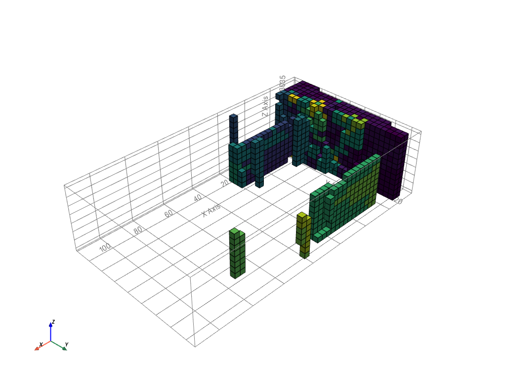{align=left}
  <figcaption>Fig. 59 Mass variant, float function on</figcaption>
</figure>

### Both on:
The third time we ran the simulation with both behaviours on. The third configuration is similar to the second configuration. The difference is that there are some holes in the wall, because of the maximum building depth of 3 voxels. However, for the overall shape, the behaviour of preventing floating parts has more impact than the limitation of the building depth. 
As with the previous configuration is this mass too high, so it will cast too much shadow, as the building is outside the solar envelope, and is therefore not a fit for our project.

<figure markdown>
  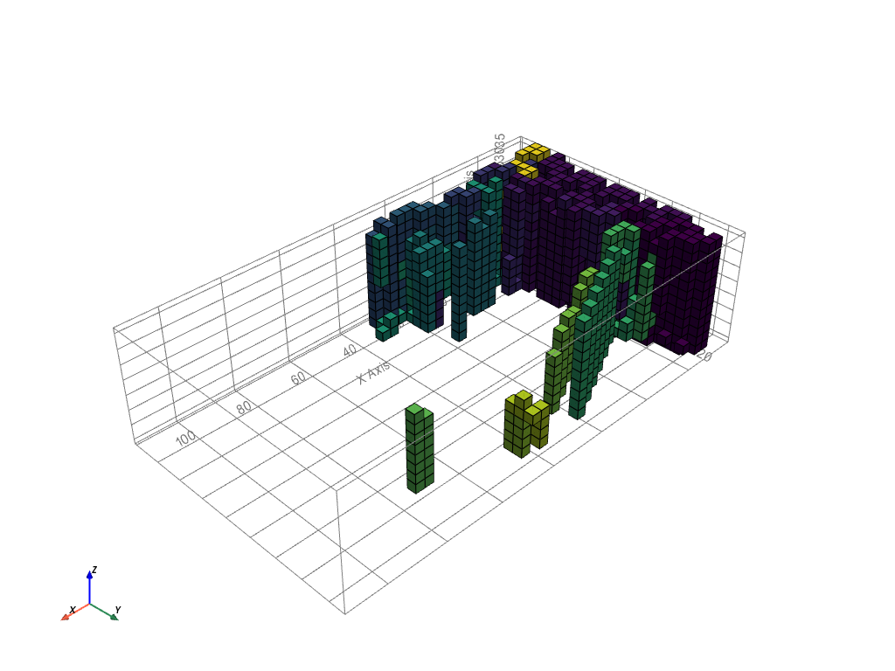{align=left}
  <figcaption>Fig. 60 Mass variant, both functions on</figcaption>
</figure>

### Building depth:
For the last configuration, only the limitation of the building depth is used. We choose a maximum building depth of 3 voxels, because then the building depth will become at most about 10 metres. When there are windows on both sides, most part of the building will be able to get sunlight. 
The result is a configuration which looks like the first configuration, but with a lot more height differences in the roof and walls. Therefore the sun can penetrate the building at more places. Next to that, the building does not cast too much shadow on the surrounding. To conclude, this configuration fits our design goals best and will therefore be our final mass. 

However, this configuration can be improved in later projects. At this moment, the building depth behaviour does not take into account that there can be an agent above an empty voxel. The effect is that there are holes in the middle of the building where still the sun cannot get. To create a building which will at all places receive as much sun as possible, the building depth behaviour needs to be adapted. 

<figure markdown>
  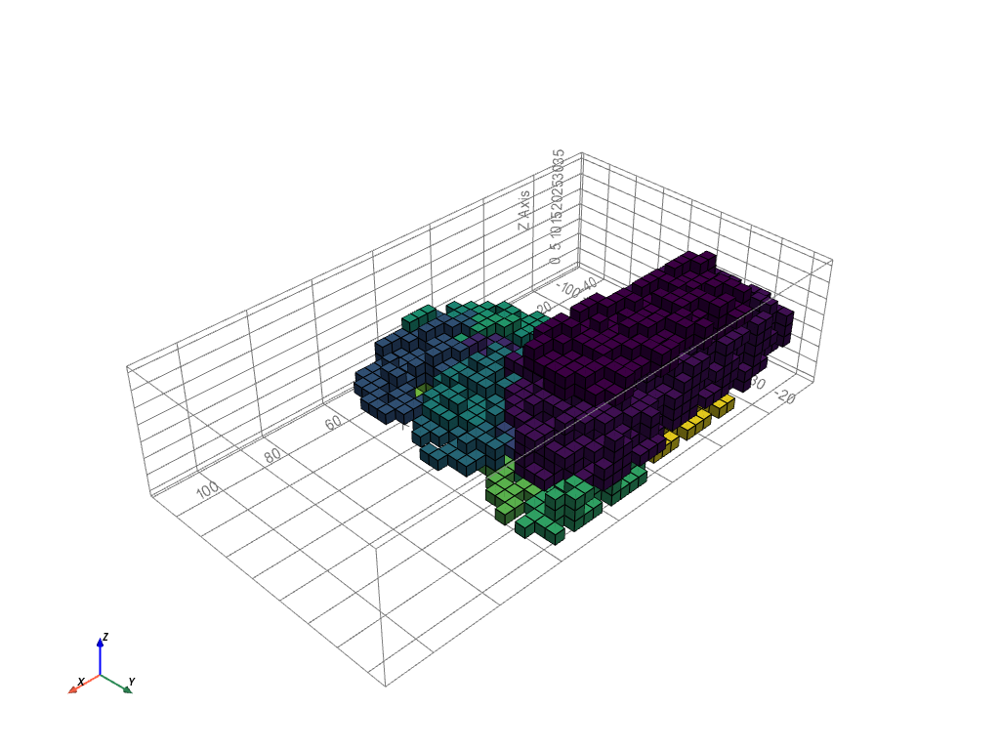{align=left}
  <figcaption>Fig. 61 Final mass, float off, depth on</figcaption>
</figure>

### GIF growth example
> The gif below shows an example of the development of the field, which means where the agent wants to grow. The student house is chosen for this example. At the initialisation stage, the agent only looks at the external preferences, such as sun access and distance to the entrance. At this point the agent wants to be at the right of the envelope. When the agent starts to grow, it will also take the connection between other agents into consideration. It slowly wants to grow more towards the middle. This analysis gives an insight in the way the agents want to behave. 

<figure markdown>
  {align=left}
  <figcaption>Fig. 62 Student house growth</figcaption>
</figure>

### ** Centers of clusters**
> To be able to compute the shafts and corridors throughout the building, we first need to calculate the average voxel of each agent. This is done by calculating the centre of each cluster.
<figure markdown>
  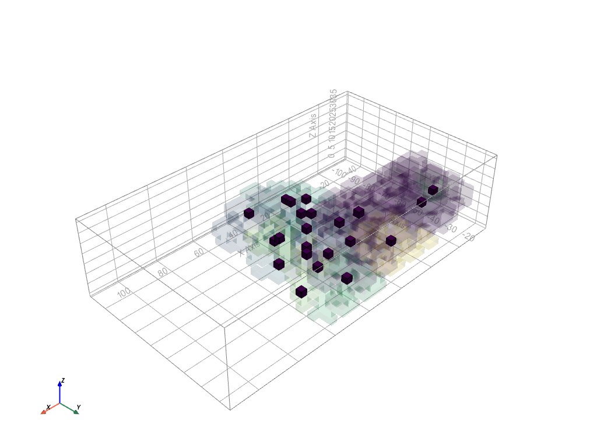{align=left}
  <figcaption>Fig. 63 Centers of clusters</figcaption>
</figure>

** Pseudo code**
``` python title="Cluster_centers.py" linenums="1"
Input: massing lattice

Find the different clusters in the grown ABM
Choose which voxel fits the best as centre of the agent cluster

Output: cluster centers
```

### ** Shafts**
> The shafts will be placed at the most central places of the building. Therefore the centres of the clusters are used to find the four most central places, these are the places for the shafts.
<figure markdown>
  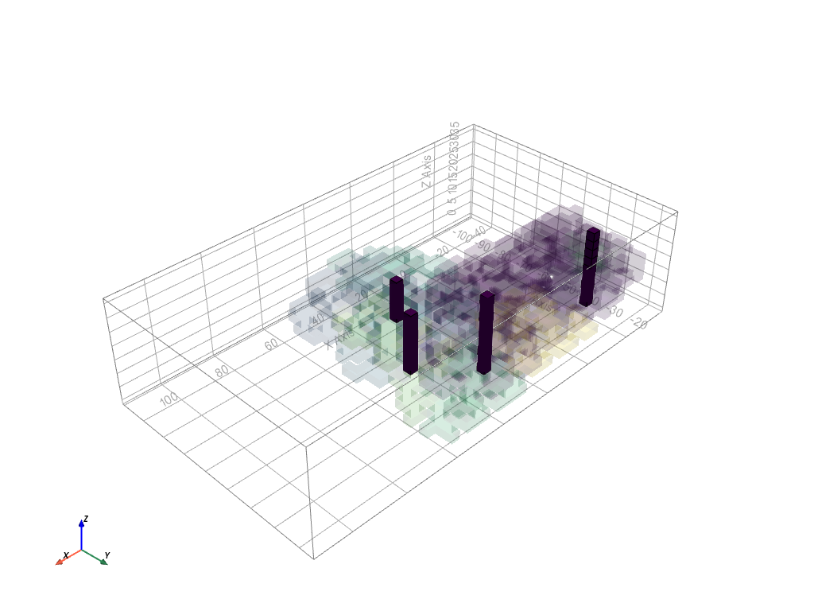{align=left}
  <figcaption>Fig. 64 Shafts</figcaption>
</figure>

** Pseudo code**
``` python title="Shaft_forming.py" linenums="1"
Input: cluster centers

Create 4 clusters from the chosen cluster centres
Choose which row of voxels fits the best as centre of the clusters

Output: shafts
```

### ** Paths**
> The corridors will create paths between the different spaces and the shafts and eventually will form the connection with the entrance. To lose the least space on corridors, the shortest path is found between the space and one of the shafts. On ground level the shafts are connected to the main entrance, so the visitors will be able to get to the entrance. 
<figure markdown>
  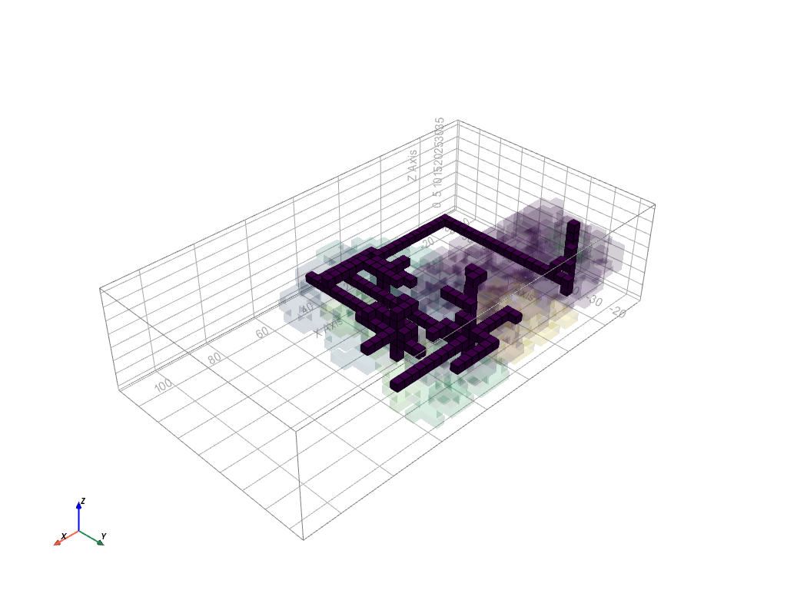{align=left}
  <figcaption>Fig. 65 Paths</figcaption>
</figure>

** Pseudo code**
``` python title="Corridor_forming.py" linenums="1"
Input: shafts, main entrance

For every cluster center
  Find the shortest path to a shaft
For every shaft
  Find the shortest path to the main entrance

Output: corridors
```