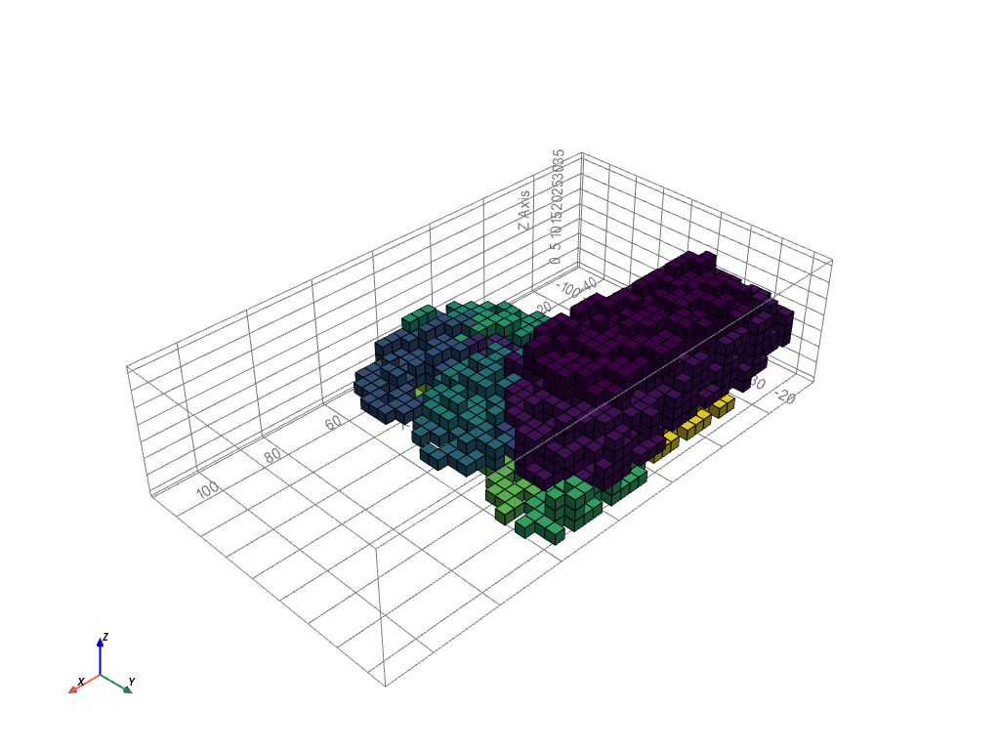

# **Massing: product**

### ** GIF massing**
> In this gif you can see speeded version of the ABM growth.
<figure markdown>
  {align=left}
  <figcaption>Fig. 66 Gif of the massing</figcaption>
</figure>

### ** Final mass**
> Shown here is our final mass, using only the function of the building depth. In the mass the public and private parts of the building are seperated, the public spaces are located around the ground floor and towards the south, whereas the private spaces such as housing are oriented towards the north of the building.

<figure markdown>
  {align=left}
  <figcaption>Fig. 67 Final mass</figcaption>
</figure>

<figure markdown>
  {align=left}
  <figcaption>Fig. 68 Legend 1</figcaption>
</figure>

<figure markdown>
  {align=left}
  <figcaption>Fig. 69 Legend 2</figcaption>
</figure>

<figure markdown>
  {align=left}
  <figcaption>Fig. 70 Legend 3</figcaption>
</figure>

### ** GIF floors**
<figure markdown>
  {align=left}
  <figcaption>Fig. 71 Floor plan gif</figcaption>
</figure>

### ** Floor plan context**
> The image below shows the floor plan included in the urban context. There are three bigger entrances at all sides of the building. The left spaces on the plot are filled with mainly greenery. This is done to achieve one of the design goals, extending the existing green structures. At the left corner a lot of public spaces come together. To encourage people to meet each other, a terrace is created. The right side of the plot is mainly filled with greenery and little paths to connect the building with the surroundings.

<figure markdown>
  {align=left}
  <figcaption>Fig. 72 Top view of the building in context with the city</figcaption>
</figure>

### ** Flow diagram notebooks**
> This flow diagram shows the connection between all the different datasets, notebooks. The datasets which are created by us are shown in purple, the used notebooks are blue and the extra functions we created are shown in yellow. All the different dataflows eventually lead to one output: the building mesh.

<iframe src="https://drive.google.com/file/d/1ktS7Xo1TA7JSXAQctYEvab5elJg8NCov/preview" width="900px" height="300px"></iframe>
Fig. 73 Flow diagram notebooks

