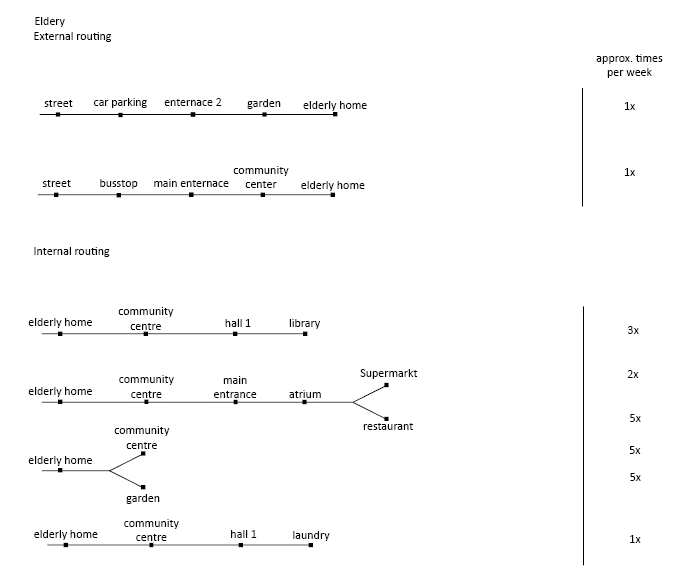

# **Planning: process**

## Introduction
> In this section there is information about the work that has been done before the actual design process. Goals and principles are stated, a program of requirements is drawn up and the users of the building are analysed. The results of the planning phase will help to decide on what is the needed data for the configuring part.

### **Design goals**
* Using the existing surrounding structures and creating a new function/environment. (train)
    * Next to the site there is an unused train track. The train track is currently used  by restaurants and cafés. The train track provides a unique and creative location and is attractive to business owners and new developers. Especially since it's close to the city centre, the location provides a lot of potential.
* Integrating surrounding wall paintings on the site
    * The area around the site has a lot of different wall paintings. This is something characteristic of Rotterdam, and especially Rotterdam-north. An improvement on the side would be integrating these artistic pieces on the building site and the surrounding area.
* Keeping existing businesses on the site and in the building
    * Currently the building is used by various restaurants, businesses and foundations. The idea is to keep these businesses on the newly developed site and integrate them into the new program.
* Expanding and connecting surrounding green structures to create qualitative greenery
    * The area is currently divided into different sections of greenery. The disconnection between the green structures creates a low quality of green. by connecting and expanding the greenery, a more qualitative feel is created.
<figure markdown>
  {align=left}
  <figcaption>Fig. 4 Green analysis</figcaption>
</figure>

* Creating an accessible connection between the building and the surrounding area. 
    * By making entrances facing general accessibility points or entrance areas the site becomes more open towards the public
<figure markdown>
  {align=left}
  <figcaption>Fig. 5 Transport analysis</figcaption>
</figure>

### **Design principles**
* Creating a good living condition which includes:
    * enough daylight in every space
    * reduce sound pollution
    * view on greenery
* Public spaces are separated from the private and communal spaces. Public functions are easily accessible form public routes.
* Modules or components can be combined in a flexible way across the building, by using a standardized grid system
    
<figure markdown>
  {align=left}
  <figcaption>Fig. 6 Living conditions</figcaption>
</figure>

<figure markdown>
  {align=left}
  <figcaption>Fig. 7 Seperate public and private spaces</figcaption>
</figure>

<figure markdown>
  {align=left}
  <figcaption>Fig. 8 Modularity</figcaption>
</figure>

### **Program of Requirements**
> In the table below the requirements for every type of space is defined. The amount of housing units is predefined in the exercise. The table shows the type of space, size in m², size per unit (for housing) and the amount of voxels per space. 
<iframe src="https://docs.google.com/spreadsheets/d/1XmZAKAe31Q7rZtItQ0VYwhmj-Pk_ns4Jj57-CN8EY_8/preview" style="width:100%;height:500px;"></iframe>
Fig. 9 Program of requirements

### **Routing**
> We created different routings for the different target groups of the building; students, starters, elderly and visitors. For the first three groups we separated the routes to their homes (external routing) and the routes they take inside the building (internal routing). The routing diagrams also include the approximate times of occurrence per week. This will help weigh each connection between the spaces.
<figure markdown>
  {align=left}
  <figcaption>Fig. 10 Users of the building with their characteristics</figcaption>
</figure>

**Students** 

*Fig. 11 External*

*Fig. 12 Internal*

**Starters**

*Fig. 13 External*

*Fig. 14 Internal*

**Elderly**

*Fig. 15 External*

*Fig. 16 Internal*

**Visitors**

*Fig. 17 External*

