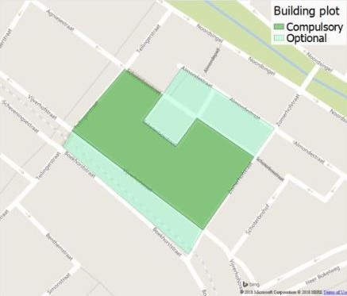

# Spatial Computing Project ** 8bit hub **
___
  
  Fig. 1 Render of the project

> This is the website for the final project of the minor Spatial Computing in Architectural Design at TU Delft, as given at the faculty of Architecture and the Built environment. We are a group of four students following the course BK7083: Computational Design Studio. On this site we show the process and products of all the steps in our project towards making a final building. The progress is split up into four parts: Planning, Configuring, Massing and Forming. There is also a Final Deliveries section where the scripts, figures and other important information are gathered.

<figure markdown>
  
  <figcaption>Fig. 2 Logo</figcaption>
</figure>

### **Design Challenge**
The objective is to design a housing complex incorporating several communal/public facilities for a cooperative live-work-play association. The  housing  complex  is  to  accommodate  students, young graduates (starters), and elderly. The complex also provides communal/public facilities. 

### ** Location **
This project is located in Rotterdam, the block between Vijverhofstraat, Zomerhofstraat, Schoterbosstraat, and Teilingerstraat (see Figure 1).  
The location is split into compulsory and optional development. The part that has to be changed is the big multi-functional building. However, the old railway line, football park, restaurant and green park in the light green areas can be incorporated as well. If the optional parts are included, any streets or pathways crossing this region should be integrated into the design, without losing their original function.

<figure markdown>
  
  <figcaption>Fig. 3 Location</figcaption>
</figure>

### ** Program of requirements**
* The program of requirements lists the spaces below:
    * Housing:
        * Student Housing 80 units 
        * Assisted Living 30 units 
        * Starter Housing 100 units 
    * Communal Spaces: 
    * Underground Parking (minimum of 0.5 parking lots per apartment) 
    * Vegetation (minimum 30% of the plot) 
    * Workshops/Fab-Labs/Co-working Space and Start-up Offices  
    * Library + Cinematheque + Café/Pub + [pinball] Arcade 
    * Co-cooking/Restaurant 
    * Community Centre 
    * Shop (grocery, tools and crafts) 
    * [electricity producing/odourless /geek-friendly] Gym